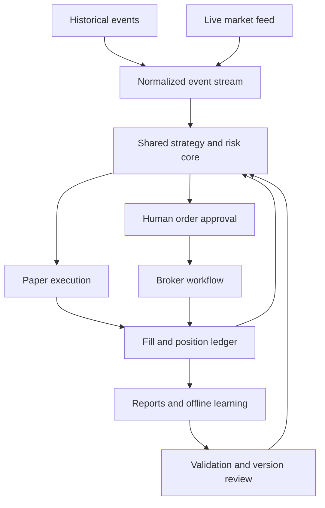

**NIFTY and SENSEX options-buying system: complete implementation plan**

Prepared for Soumya Podder • 7 September 2026 • All operating times are Asia/Kolkata (IST).

**Status: specification only. No strategy backtest has been run for this plan, no historical dataset has been validated, and no broker account has been accessed or traded.** Numerical examples below are arithmetic illustrations, not historical performance. Proposed thresholds are initial research settings, not proven optimal parameters.

**1. Define the mandate and the limits of the promise.** Build an autonomous research, replay, paper-trading and reporting system, with a separate supervised live workflow. Live orders require human approval; a reviewed entry can include supported broker-native protective instructions. The chat assistant does not independently operate an investment account. A continuously running service, data entitlements and an execution operator are deployment requirements.

| Requirement | Specification |
| --- | --- |
| Trading capital | ₹30,000 starting capital; use actual available cash thereafter |
| Instruments | Purchased NIFTY calls/puts on NSE and SENSEX calls/puts on BSE |
| Daily objective | ₹1,200 gross trading profit before charges, treated as an aspiration and stopping condition |
| Daily loss budget | ₹850 after estimated trading charges; this is the conservative interpretation of the requested limit |
| Observation window | 09:15–15:25, with earlier entries/exits controlled by the strategy and risk policy |
| Assessment cadence | Every 2 seconds, plus event-driven position/risk updates |
| Initial exposure | One open position, one exchange lot, across both indices combined |
| Learning | Daily ingestion, attribution and challenger evaluation; deployment changes only after validation and review |
| Backtest visibility | Full run metadata, trade ledger, costs, daily results, failure modes and uncertainty |

₹1,200/₹30,000 is **4% gross per day**. Twenty days at that target would mean ₹24,000, or 80% of starting capital before charges. ₹850 is 2.83% of starting capital. These calculations describe the requested ambition; they do not establish an achievable return. Profitable days, losing days and no-trade days must all be reported.

A stop-loss budget is not a guaranteed loss bound. A long option costing ₹13,000 can lose substantially more than a ₹300 planned stop if prices jump or the exit fails. A ₹200 execution reserve cannot cover every tail event. If ₹850 means an absolute never-breach condition, a stop-based implementation cannot satisfy it. Full-premium-at-risk limits would be necessary for a payoff-level bound and may leave no suitable one-lot trades. Do not solve this by automatically buying very cheap far-OTM contracts.

The operating priority is: enforce the authorized risk envelope, avoid invalid or unsupported trades, pursue positive net expectancy, and measure progress toward the gross target. The daily target never overrides a risk veto or creates an obligation to trade.

**2. Load current and historical market rules.** Current published specifications identify NIFTY lots as 65 units and SENSEX lots as 20. NIFTY weekly expiry is Tuesday and monthly expiry is the last Tuesday; SENSEX specifications use Thursday and the last Thursday. Exact contracts and holiday adjustments must come from the dated instrument master. The NIFTY change from 75 to 65 is documented in the October 2025 circular with the transition into 2026 contracts. [NSE lot-size circular](https://nsearchives.nseindia.com/content/circulars/FAOP70616.pdf), [NSE contract specifications](https://www.nseindia.com/static/products-services/equity-derivatives-nifty50), [BSE contract specifications](https://www.bseindia.com/static/markets/derivatives/derireports/contractindex).

| Instrument | Exchange | Current lot used for examples | Gross value of 1 premium point | Premium move for ₹1,200 gross on 1 lot |
| --- | --- | ---: | ---: | ---: |
| NIFTY | NSE | 65 | ₹65 | About 18.46 points |
| SENSEX | BSE | 20 | ₹20 | 60 points |

Round actual order prices to the applicable tick size. NIFTY +20 premium points would produce ₹1,300 gross on one 65-unit lot; SENSEX +50 and +100 points would produce ₹1,000 and ₹2,000 respectively on one 20-unit lot. These are premium changes, not index-point moves, and do not account for earlier trades' losses or charges.

Market timing has changed since older plans: NSE now publishes equity-derivatives hours of 09:15–15:40, while eligible cash stocks transition into a closing auction at 15:15. BSE's own August announcement also identifies a 15:40 F&O close. Dhan schedules derivatives intraday auto-square-off at 15:25. The user's 15:25 endpoint is therefore an operating deadline, not a statement of the exchange close. [NSE closing-auction/session information](https://www.nseindia.com/static/products-services/closing-auction-session), [BSE official announcement](https://x.com/BSEIndia/status/2084199941778583740), [Dhan square-off schedule](https://dhan.co/support/general/market-session-status-and-timing/what-are-the-dhan-intraday-auto-square-off-timings/).

For version 1, target flat positions by 15:10 and observe/reconcile afterward. Treat post-August-2026 behavior as a separate evaluation period. Distinguish cash index, indicative auction index, futures and option quotes in the data model. Never silently substitute one for another. BSE contract/session conclusions above use indexed official-source content where direct page retrieval was unavailable; the implementation must verify actual master files and account capabilities before activation.

**3. Make the capital and risk arithmetic explicit.** Premium cash and potential stop loss are different constraints. An affordable position can still have unacceptable downside.

| Hypothetical position | Premium paid | Planned premium stop | Gross stop loss |
| --- | ---: | ---: | ---: |
| 1 NIFTY lot at ₹200 | ₹13,000 | 10 points | ₹650 |
| 1 SENSEX lot at ₹500 | ₹10,000 | 25 points | ₹500 |
| Both together | ₹23,000 | Both stops hit | ₹1,150 before charges |

This pair fits the capital but fails the daily loss budget. NIFTY and SENSEX also share broad equity-market exposure; portfolio stress tests must allow both to lose together. Do not assume offsetting index directions form a reliable hedge.

The proposed conservative research configuration is:

| Control | Initial setting | Enforcement |
| --- | ---: | --- |
| Maximum capital committed to premiums and pending entries | ₹24,000 | Also bounded by actual cash after charges and existing debits |
| Cash reserve | At least ₹6,000 at inception | Separate from the loss allowance |
| Planned all-in risk per new position | At most ₹300 | Includes expected fees and adverse execution allowance |
| Planned daily loss allocation | ₹650 | Shared by all strategies and both exchanges |
| Emergency execution reserve | ₹200 | Residual of the ₹850 requested budget; not a guarantee |
| Daily flatten trigger | Net executable account P&L at or below −₹650 | Trigger early to leave room for execution uncertainty |
| Entries per session | At most 3 filled entry attempts | Reentries and scale-ins count; order retries do not create a new allowance |
| Losing trades | Stop new entries after 2 net losing trades | Includes trades profitable before costs but negative after costs |
| Open positions/lots | 1 position / 1 lot | Later scaling is a separately validated configuration |
| Initial cooldown after an exit | 5 minutes and a new valid setup | Freeze for the session; evaluate alternatives offline |

The ₹300 setting may be too restrictive for many ordinary moves. With a purely illustrative ₹100 combined cost/execution allowance, only ₹200 remains for the premium move: about 3.08 NIFTY points or 10 SENSEX points per lot. These distances may be inside normal price noise. Establish the structurally sensible stop first; if its risk exceeds the limit, reject the trade. Never shrink a stop just to make a spreadsheet accept the position. Phase 1 must measure how often the lot-size/risk combination is feasible.

Define admission risk using the worst entry fill price allowed by the proposal:

`planned_risk(n) = n × lot_size × (allowed_entry_price − planned_stop_price) + estimated_round_trip_fees(n) + extra_execution_allowance(n)`

Here the stop is a trigger/plan, not an assured fill. The additional allowance models execution below that trigger. Reject invalid stops or stale quotes. Enumerate integer lot counts against both cash and risk rather than assuming fees scale exactly with quantity. In version 1, the permitted counts are simply zero or one.

Maintain a durable loss ledger:

`remaining_allocation = max(0, 650 − realized_loss_spend − reserved_open_risk − reserved_pending_risk)`

`realized_loss_spend` sums the magnitudes of net losses on closed trades; winners do not refill it. Reserve the full initial planned risk while a position is open, even if a trail improves. Atomically move reservations between pending, open and closed states. Do not release a reservation merely because an HTTP request timed out. A single risk authority must serialize admissions across all agents.

Independently compute current liquidation P&L from realized fills plus sell-side executable value of open longs, less incurred and estimated remaining charges. Use available depth for the quantity, not an optimistic last price. Check projected loss if existing and proposed positions hit their stressed exits. Use both the conservative loss-spend limit and the executable equity check; passing one is insufficient.

At the daily profit condition, calculate cumulative gross P&L across all trades, including prior losses, using conservative liquidation estimates for any open position. In paper mode, close the position and lock new entries once the target condition fires. The supervised workflow presents that action or uses an explicitly approved supported broker instruction. Final fills can leave realized P&L below ₹1,200; do not reopen to recover the shortfall.

Never average down, martingale, widen a stop, reset a daily counter after restart, or increase risk because the target has not been reached. Proposed research pause settings are a ₹1,700 weekly net loss or ₹2,550 marked-to-market drawdown from the strategy equity high, whichever triggers first. These are review gates, not loss guarantees or permissions to spend the entire daily budget repeatedly.

**4. Give agents distinct jobs and one shared state.** Implement these as logical modules first. They do not need separate LLM processes or independent copies of market data. The risk controller and order owner are singular authorities.

| Agent | Inputs and responsibility | Output/authority |
| --- | --- | --- |
| Data Integrity Agent | Stream continuity, contract mapping, quote age, timestamps and missing fields | Data-quality report; veto new risk on invalid data |
| Calendar and Event Agent | Trading calendar, expiry, scheduled announcements, current session rules | Entry blackout/session flags with source and effective date |
| Market Regime Agent | Completed bars, volatility, trend structure, breadth, time of day | Trend/range/expansion/uncertain state and support count |
| Setup Agent | Small registry of precise entry conditions | Versioned candidate, direction, invalidation, horizon |
| Greeks and Volatility Agent | Delta, gamma, theta, vega, IV surface and input ages | Risk scenarios and decay/IV suitability; no standalone direction vote |
| Flow Context Agent | Futures/option volume, OI, spread, depth and their update ages | Labeled contextual features; no claims of knowing institutional intent |
| Contract Selection Agent | Approved expiry set, strike candidates, quote liquidity, cash requirements | Ranked exact contracts, including a zero-contract outcome |
| Portfolio Risk Agent | Ledger, all open/pending orders, planned stops, fees and scenario losses | Binding admit/reject decision and atomic risk reservation |
| Exit Policy Agent | Entry thesis, executable option path, time in trade and frozen policy | Hold/exit/tighten proposal with reason code |
| Execution and Reconciliation Agent | Approved proposal or simulated instruction, broker events | Single order lifecycle, fill ledger and discrepancy alerts |
| Replay Agent | Immutable events, simulated clock, dated market rules | Reproducible historical or recorded-session execution |
| Learning and Validation Agent | Completed labels, experiments, walk-forward results | Challenger model/policy; cannot alter risk limits |
| Audit and Reporting Agent | All inputs, decisions, orders, fills and versions | Dashboard, reports, comparison tables and exportable evidence |

The coordinator applies hard vetoes before ranking surviving candidates. Related EMA, RSI and momentum signals are correlated; several agents repeating the same information are not independent confirmations. When two candidates survive, select the one with stronger validated net expectancy per unit of risk and sufficient evidence, subject to the single-position rule.

Use deterministic code for price handling, risk, sizing and position state. An LLM may summarize evidence or suggest an offline experiment. It must not invent prices, supply uncalibrated confidence percentages, or control emergency decisions. Keep optional model-service costs and outages outside the critical path.

**5. Separate continuous ingestion from the two-second assessment.** The requested window contains 11,100 two-second intervals. That is a monitoring cadence, not a target for trades, order modifications or independent training samples.

Dhan provides event-based market WebSockets. Stream the two indices, relevant futures/constituents, and a small liquid options universe around candidate strikes/expiries. Record every event received, and record sequence gaps; do not claim complete exchange-tick coverage from a retail feed. A two-second heartbeat evaluates current state and updates the dashboard. Position/risk handling reacts to relevant events without waiting for the next heartbeat. [Dhan live market feed](https://dhanhq.co/docs/v2/live-market-feed/).

Dhan limits an identical underlying/expiry option-chain request to once per three seconds. A shared collector should request each required chain every 3–5 seconds and record the true age of Greeks and OI. REST quote snapshots are limited to one request per second with batching. These documented constraints prevent a truthful promise of fresh broker Greeks every two seconds. [Option-chain API](https://dhanhq.co/docs/v2/option-chain/), [Market quote API](https://dhanhq.co/docs/v2/market-quote/).

Locally recomputed Greeks may use newer quotes, but label them as model estimates and preserve their inputs, rate/time conventions and version. Do not present a recomputation as a fresh exchange observation. Dhan's 20/200-depth service is NSE-only; a common cross-index model must use features actually available for both exchanges, or maintain separately validated feature sets. [Full depth documentation](https://dhanhq.co/docs/v2/full-market-depth/).

Initial engineering targets are a two-second decision heartbeat and p99 local processing below 250 ms for the bounded universe, measured under load. These are build acceptance targets, not observed performance. Distinguish feed heartbeat age, quote availability age, last-trade age and provider field-update age. A recent last trade is not proof that an old quote is current.

For new entries, initially require a usable option quote no older than two seconds, consistent underlying inputs and no unresolved sequence/reconciliation problem. Configure age limits per field and validate them against actual provider cadence; a five-second-old chain field is not automatically equivalent to a five-second-old executable quote. If a required observation is missing or too old, wait. Record the exclusion and resulting trade coverage.

**6. Use Greeks to compare contracts and holding risk.** Gamma measures how delta responds to the underlying. Long calls and long puts have positive gamma; it is not a directional resource that accumulates on one side and then must trigger a rally. Gamma is generally strongest near ATM around expiry. Theta is conditional model sensitivity and time decay is nonlinear. [OIC gamma](https://www.optionseducation.org/advancedconcepts/gamma), [OIC theta](https://www.optionseducation.org/advancedconcepts/theta).

OI counts outstanding contracts, each with a buyer and seller. Inferring dealer long/short inventory or a signed dealer-gamma position from aggregate OI alone requires unobserved assumptions. Store those assumptions explicitly if such a model is researched; otherwise omit signed dealer-gamma claims. [CME volume and open-interest definitions](https://www.cmegroup.com/market-data/volume-open-interest/about.html).

For explanatory scenarios, use:

`change_in_premium ≈ delta × change_in_index + 0.5 × gamma × change_in_index² + vega × change_in_IV + theta × elapsed_time`

All units must match: per option unit versus per lot, IV percentage points versus decimal volatility, and calendar-time conventions. Do not divide a broker's daily theta mechanically by the session minutes. For substantial moves or near-expiry stress, reprice over a spot/IV/time grid rather than trusting the local approximation. IV declines can offset a correct directional call. [OIC vega](https://www.optionseducation.org/advancedconcepts/vega).

Contract ranking should consider estimated net payoff distribution, delta response, premium debit, spread/depth, expected hold duration, decay exposure, IV-crush scenarios and expiry. Start research with ATM/modestly ITM contracts and a predeclared delta band such as absolute delta 0.45–0.70. Treat the band as an experiment; do not force a trade if none fits cash and risk.

Version 1 excludes expiry-day entries and unvalidated event sessions. Later expiry research must have its own data, stress tests, policy version and approval. Earlier hero-zero ideas do not override this initial risk policy. When replaying actual option prices, theta and IV effects are already in those prices: never subtract modeled theta a second time from P&L.

**7. Research three bounded strategy families.** Implement one baseline completely before adding the next. These are hypotheses, not claims of an edge. Select direction from underlying structure and select the option only after that hypothesis is valid.

| Family | Initial entry hypothesis | Initial invalidation/exit hypothesis |
| --- | --- | --- |
| Opening-range breakout with retest | Build 09:15–09:30 range; a completed 3-minute bar breaks it; a subsequent completed 1-minute retest holds; resumed direction creates a candidate | Failed retest, return into the range, structural failure or inadequate progress within the declared horizon |
| Trend pullback continuation | Completed 5-minute structure and 9/21 EMA direction agree; price pulls back to a predeclared support/resistance or futures VWAP region; completed 1-minute resumption confirms | Pullback structure fails, opposing momentum invalidates the thesis, or continuation stalls |
| Compression then expansion | A completed range has low realized movement relative to its prior distribution; a completed bar breaks the range with validated participation | Return into compression, failed expansion, time stop or adverse volatility change |

A first executable baseline must define exact candle boundaries, equality handling, warm-up, buffers, retest expiry, stop mapping and duplicate-signal reset. Example research defaults are a 0.1×ATR breakout buffer and a retest within five completed one-minute bars. Freeze the definitions before evaluation and keep the parameter search small. Do not label these illustrative defaults as optimal.

Use completed bars for the stated timeframe. Record a signal only after the bar is actually available. Enter at a subsequent executable quote after all processing and approval delays, never retrospectively at that bar's close. A candidate expires if its thesis, quote range or risk validity changes before action.

Spot indices have no directly traded volume. Futures VWAP/volume and constituent breadth must be identified as proxies, with dated futures rolls and point-in-time constituent membership/weights. Missing volume cannot silently become zero or a fabricated spot-index VWAP. Avoid train/live mismatches caused by using a different proxy on SENSEX.

Use ablation tests: baseline structure alone, then add one filter such as breadth, IV or liquidity. A filter earns inclusion only if its net benefit persists out of sample. Maintain failed-breakout reversals and other new logics as challengers; do not blend conflicting strategies through discretionary votes.

**8. Turn confidence into an evidence test.** All hard checks must pass before a probability model is consulted: active session, valid metadata, fresh data, allowed regime/expiry, healthy execution state, sensible structural stop, available risk and cash, sufficient liquidity and no duplicate/conflicting position.

For an eligible candidate, estimate outcomes from comparable past samples or a calibrated model. Report the predicted probability, realized calibration, supporting independent trades and uncertainty. An LLM saying 90% confident is not a usable probability estimate.

If wins and losses are already net of all costs:

`expected_net_P&L = p_win × average_net_win − (1 − p_win) × average_net_loss_magnitude`

Do not subtract costs twice. Rank opportunities by conservative net expectancy and downside exposure, not win rate alone. A nominal reward/risk of at least 2:1 is an initial eligibility requirement, but both the reachable reward and its probability require evidence; a faraway target does not create an edge. Reject a trade when the uncertainty interval does not establish a credible benefit over remaining flat.

Other explicit no-trade reasons include event uncertainty, unvalidated volatility regime, excessive spread relative to the planned move, insufficient depth, decay/IV downside overwhelming the plausible hold payoff, maximum losses, exhausted daily allocation, profit lock, and unresolved order state. A no-trade day is a valid result, not a failed quota.

**9. Make exit policies executable and comparable.** Calculate exits using executable bid/depth for a long position, while preserving the actual trigger basis of any broker-native stop. The paper engine and live observation must not confuse an LTP-triggered stop with a bid-triggered application rule.

| Priority | Condition | Policy |
| --- | --- | --- |
| 1 | Account risk breach, unreconciled exposure, severe execution failure | Freeze new risk; invoke the approved protection/recovery workflow and raise an incident |
| 2 | Initial protective stop or structural invalidation | Full exit under the predefined policy; never widen the stop |
| 3 | Session deadline or defined event boundary | Full exit; no overnight strategy exposure |
| 4 | Time stop / statistically unsupported continuation | Exit at available prices, even for a small loss/profit |
| 5 | Target or validated trailing rule | Full exit on one lot; trail only according to the frozen policy |

Initial exit candidates are: fixed structural stop with a reachable target; structure-based trailing; volatility-based trailing; and a fixed no-progress/time stop. Predeclare a small holding-horizon set, such as 3, 5, 10 and 20 minutes, for research. These alternatives are evaluated as complete policies, not chosen after seeing each trade's best price.

Breakeven must include round-trip charges and realistic execution, not simply the entry premium. Immediate trailing after a tiny favorable move can turn normal noise into repeated stopped trades; measure this rather than assuming tighter is better. Multiple-lot scale-outs need whole-lot quantities and incremental cost/risk analysis. One exchange lot cannot be sold as half a lot under normal lot-based orders.

In the supervised live workflow, a proposal contains the exact contract, maximum entry price, quantity, protective stop, optional supported target/trail, thesis expiry, anticipated costs and risk. At approval, revalidate the quote, setup and risk; stale approval is not permission to chase. Model approval delays and missed approvals in live-comparable simulations. New discretionary actions or policy changes require review; approved broker-native contingent instructions follow their documented behavior.

**10. Build one core for replay, paper and supervised live observation.** Keep the same feature code, model artifact, strategy rules, calendar, state transitions, risk math, quantity rounding and cost definitions. Change only the clock, event source and execution adapter.

The review-to-core connection applies only to a future session. A day begins with a frozen model/configuration hash; learned changes do not enter an open trade. Keep broker fill events distinct from simulated fills at the type/storage level so paper actions cannot reach live routing accidentally.

The promise is reproducible decision logic under the same known inputs and state. It is not identical prices, fills or profits. Historical replay cannot know every queue position or change the historical order book, and observed quotes do not guarantee executable quantity by the time an order arrives. [HftBacktest execution-model limitations](https://hftbacktest.readthedocs.io/en/py-v2.1.0/order_fill.html).

**11. Resolve data fidelity before showing a return.** The previously discussed paper-mode FastAPI project does not establish that historical option data, completed agents or profitable backtests exist. Audit available code/data as a separate first implementation task. This document does not certify that project.

Dhan's expired-options endpoint provides minute-level rolling ATM-relative OHLC/IV/OI/volume history, with documented coverage limits. This is a preliminary research input, not historical two-second bid/ask data. [Dhan expired-options history](https://dhanhq.co/docs/v2/expired-options-data/).

| Validation level | Required evidence | Permitted claim |
| --- | --- | --- |
| Unit/scenario simulation | Synthetic inputs with known expected behavior | Software behaves correctly in the tested scenario |
| Preliminary bar backtest | Actual, validated fixed-contract minute paths and conservative assumptions | Coarse historical signal/risk exploration |
| Quote/event replay | Timestamped actual-contract quotes/trades and available quantities | Execution-aware results at the supported observation fidelity |
| Forward paper/shadow | Recorded live feed and frozen policy with a conservative simulator | Performance of simulated decisions on newly observed conditions |
| Supervised live validation | Approved orders and actual broker fills | Real measured execution/P&L for that sample |

Synthetic prices must never silently replace failed live data. Show a separate demonstration mode with synthetic labels. A market-data outage makes the trading mode unhealthy.

An ATM-relative series can change its strike. Every position must retain `(exchange, expiry, strike, call_or_put, instrument_id)` throughout its life. If a rolling dataset cannot reconstruct that same contract before/after entry, exclude the path and disclose the loss of coverage. Never use a newly selected ATM option as the exit price of an earlier contract.

A minute containing both the stop and the target does not tell which happened first. Conservative stop-first handling can support a clearly labeled bar study, but it does not prove execution. Interpolating prices every two seconds invents a path. Obtain appropriately licensed fixed-contract quotes or accumulate prospective recordings; verify actual coverage rather than assuming a vendor or subscription supplies it.

Data procurement should ask for timestamps and timezone, quote/trade/depth fields, fixed-contract identifiers, expiry coverage, bid/ask quantities, gaps, historical rule metadata, redistribution/storage rights and a sample spanning volatile sessions. Reject a product described as tick data if it is merely interpolated bars. If suitable data is unavailable or unaffordable, leave fine-grained validation marked `BLOCKED_DATA` and use forward recording.

**12. Persist enough information to reproduce a decision.** Keep immutable raw data and normalized analysis tables. Avoid changing old records when a parser or feature formula improves; create a new dataset version.

| Dataset | Minimum stored fields |
| --- | --- |
| Instrument master | Exchange, identifier, symbol, expiry, strike, type, lot/tick size, listing validity, source and effective time |
| Market events | Source, contract, event type, available exchange timestamp, local receive time, sequence/arrival order, price/quantity fields and quality flags |
| Option-chain snapshots | Underlying/expiry, values, provider/retrieval times, field ages, OI/IV/Greek units |
| Features | Event/candidate reference, computation timestamp, input availability, lookback, formula/model version |
| Decisions | Setup, contract, candidate state, risk estimate, calibrated score/support count, veto/exit reason, configuration hash |
| Approval records | Proposal version, bounds, creation/approval/expiry time, operator action and final revalidation |
| Orders and fills | Durable correlation ID, broker ID, lifecycle events, fills, remaining quantity, prices, rejection/cancel reasons |
| Portfolio ledger | Cash commitments, realized/unrealized P&L, incurred/accrued fees, risk reservations, locks and reset date |
| Experiments/models | Dataset hash, code/config hash, time splits, trial history, seeds, metrics, decision and deployment dates |
| Review labels | Actual hold path, MAE/MFE, fixed post-exit horizon, data completeness and counterfactual policy results |

Use UTC internally with an explicit IST trading calendar. Replay by information availability/arrival ordering, not by retrospectively sorting every input into an impossible perfectly synchronous market view. Keep labels from the future out of the feature snapshot. If an event lacks a quote-update exchange timestamp, retain that limitation; do not relabel last-trade time as quote-update time.

**13. Model execution and costs realistically.** Buys consume available asks and sells consume available bids after the simulated decision, approval and network delay. Walk depth when necessary. Model limited quantity, missed fills, partial fills where applicable, rejections, cancel/replace races and recovery. A limit touched by a candle is not an automatic fill.

Dhan documents a 10-orders/second limit and other longer-window limits, plus a modification cap. Use one central limiter and reserve capacity for protection/reconciliation. Dhan's April 2026 announcement says API market orders become limit orders with Market Price Protection and static-IP registration is required. A requested market exit is therefore not evidence of a completed exit. [Dhan API limits](https://dhanhq.co/docs/v2/), [Dhan API implementation announcement](https://madefortrade.in/t/now-live-api-regulatory-changes-on-dhanhq/63385).

For each date/exchange, include brokerage, transaction charges, SEBI fees, GST on the applicable base, stamp duty, STT and any applicable levy or forced-exit charge. Model broker rounding and reconcile to contract notes. NSE's March 2026 circular increased option-sale STT from 0.10% to 0.15% of premium effective 1 April 2026. Dhan lists ₹20 per executed F&O order. Do not apply today's entire fee schedule to earlier years. [STT effective-date circular](https://nsearchives.nseindia.com/content/circulars/FATAX73524.pdf), [Dhan pricing](https://dhan.co/pricing/).

Gross trading P&L uses actual/simulated fill prices, so spread and modeled slippage are already reflected. Net P&L subtracts applicable charges. Do not charge the full spread again after using ask/bid fills. Show infrastructure/data/model expenses separately as operating costs; if they are paid from the same ₹30,000, reduce trading capital before any sizing decision. Do not assume another funding source.

**14. Validate chronologically, including the learning process itself.** Aim for 12–24 months of relevant history when genuinely available, while reporting the exact periods and fidelity actually obtained. Partition material rule changes, including lot sizes, expiries, tax rates and the August 2026 closing-auction regime. Older history can improve research breadth without proving performance in the newest regime.

A candidate schedule is six months training, one month validation and the following month out-of-sample testing, rolling forward monthly. Training windows, feature normalization and model fitting use only earlier information. Purge samples whose outcome windows overlap the next split, and add an embargo covering relevant label overlap. Group related intraday observations and resample uncertainty by day or week. Ordinary shuffled cross-validation is inappropriate for forecasting from sequential data. [Scikit-learn temporal splitting](https://scikit-learn.org/stable/modules/generated/sklearn.model_selection.TimeSeriesSplit.html), [Leakage guidance](https://scikit-learn.org/stable/common_pitfalls.html).

Walk-forward simulation must execute the exact proposed daily-learning schedule. At each simulated date, complete only labels that were then observable, train/evaluate challengers using the permitted past, apply the same promotion lag/review schedule, freeze that day's champion, then trade the next period. Training once on the entire history and replaying it is not a backtest of an adaptive system.

Pre-register a small experiment budget and track every tried feature/filter/parameter variant. Keep a final holdout untouched until the design is frozen. Once inspected, that period is used evidence and must not be called untouched again. Multiple searches can manufacture impressive historical winners by chance. Use a multiple-testing-aware assessment when the search grows. [Bailey et al., backtest-overfitting research](https://www.davidhbailey.com/dhbpapers/overfit-tools.pdf).

Compare the baseline against each strategy, each filter ablation, each complete exit policy and the combined risk-constrained portfolio. Include flat/no-trade as the zero-risk trading comparator and retain all session denominators. An apparent improvement caused by trading far more, exceeding risk or changing the test period is not a valid comparison.

Stress scenarios should include 1.5× and 2× execution friction; observed median and tail delays; 2/5/10-second feed disruptions; wider spreads/thinner depth; MPP/limit nonfills; token failure; duplicate/late broker events; process restart during an order; simultaneous target/stop races; and a sudden premium gap through the planned stop. Synthetic fault scenarios demonstrate robustness, not historical profitability. Report limit overshoots even when they are caused by execution assumptions.

**15. Learn what to take, avoid, hold and exit.** Daily learning means that the evidence grows daily. It does not mean the production policy must change daily.

After the session, finish ingestion and reconcile order/fill state. Charges may remain provisional until the contract note arrives. Record a daily diagnostic report immediately and finalize the accounting later. Candidate labels enter training only once their full defined outcome horizon is available.

Log eligible opportunities that were skipped as well as actual trades. Otherwise the learner sees only decisions the old strategy already preferred. Preserve reasons such as risk veto, weak evidence or execution failure separately. Research may evaluate a skipped candidate's hypothetical return, but an attractive later outcome cannot erase an original hard risk constraint.

For each actual long-option entry, calculate a fee-aware executable P&L path:

`p(t) = quantity × (executable_exit_price_at_t − actual_entry_fill) − estimated_complete_trade_charges_at_t`

`MFE = max(0, maximum p(t) during the actual hold)`

`MAE = max(0, −minimum p(t) during the actual hold)`

Also store realized net P&L, time to first meaningful profit, time underwater, spread evolution, thesis failure time and exit reason. Partial fills require lot/fill-weighted treatment; do not pretend the whole planned quantity was filled immediately.

| User question | Safe analysis | What must be avoided |
| --- | --- | --- |
| Which trades should it avoid? | Compare entry-time features and feasible counterfactual outcomes across all candidates, with out-of-sample calibration | Removing losses retrospectively based on future information |
| Which should it hold longer? | Replay a declared longer-hold/trailing policy within the original risk and session envelope | Crediting a rebound after the policy would already have stopped out |
| Which should book small profit? | Test whether a causal stall/structure/IV signal improves subsequent net results after costs | Assuming every small gross gain is worth another exit/reentry fee |
| Which should exit at a small loss? | Compare predefined thesis-failure/time-stop rules against the full-policy baseline | Tightening until historic noise disappears or widening after loss |

Continue quote recording for a fixed post-exit horizon where available. Report its best price as hindsight opportunity, not attainable profit. Never choose the best historical exit separately for each trade and add those gains together. Replay each complete policy with daily limits, subsequent trade opportunities and exposure occupancy included.

Begin with descriptive buckets and a simple calibrated entry-quality model. Add an exit-policy selector only after sufficient independent samples exist. Limit features to observable quantities: time, regime, realized volatility, IV/Greeks and ages, structure, spread/depth, normalized progress and holding duration. Prefer interpretable models before complex reinforcement learning. Risk limits, capital permissions and order capabilities are excluded from learnable parameters.

The learner proposes a challenger; the validator evaluates it on later data; the report explains the evidence; review accepts or rejects the version. Deploy accepted versions only at a session boundary, preserve the previous champion, and support rollback. On sparse or conflicting evidence, retain the current version or pause a strategy. A few profitable trades do not justify a policy change.

**16. Define advancement gates before looking at results.** These are proposed conservative acceptance criteria; none has passed yet.

| Gate | Proposed requirement |
| --- | --- |
| Data | Claimed-resolution contract/quote coverage audited; missingness, selection bias and timestamp limitations disclosed |
| Evidence | Multiple chronological out-of-sample folds; planning floor of 120 test sessions and 300 independent trades overall, with adequate support for each activated family |
| Expectancy | Positive net out-of-sample expectancy with a positive lower day-block confidence bound; otherwise research continues |
| Cost robustness | Positive net results under a predeclared adverse-friction scenario; show all tested stress results |
| Concentration | Publish contributions of the largest wins/days and results by index, direction, expiry bucket and regime |
| Downside | Report MTM drawdown, daily/weekly tail losses and ₹850 overshoots; reject the configuration if reasonable modeled conditions conflict with the required risk envelope |
| Implementation | No stale-data admission, duplicate exposure, unintentional short option, wrong contract, future-data leakage or silent order-state divergence in required tests |
| Challenger | Credible paired improvement over the champion on the same sessions without material deterioration in downside or operational behavior |
| Forward paper | At least 30 trading sessions and 50 qualifying paper trades, whichever takes longer, plus sufficient coverage of the enabled conditions |
| Live review | Human order approval, current broker/exchange/API requirements satisfied, recovery workflow demonstrated and actual costs/latency measured |

Counts are floors for planning, not statistical proof. Correlated trades lower the effective sample size. If a strategy is rare, collecting evidence takes longer; do not manufacture activity to reach the threshold. If the required data or evidence cannot be obtained within resources, the correct status is remain in paper/research.

**17. Make the dashboard prove its numbers.** Retain and repair the existing FastAPI/React project if its code is usable; a framework rewrite is not necessary to achieve observability. Every displayed metric should link to its underlying events/trades and run version.

| View | Required content |
| --- | --- |
| Session overview | Mode, connection/field ages, capital committed, remaining loss allocation, gross/net P&L, conservative liquidation P&L, locks and clock |
| Agent activity | Agent name, last successful evaluation, inputs used, concise decision/rule summary, vetoes, output, processing time and errors |
| Opportunity board | All surviving/skipped candidates, exact contracts, evidence/support count, planned stop/risk, estimated costs and rejection reason |
| Position detail | Fill-weighted entry, current executable value, protective order state, exit thesis, elapsed time, Greek exposures and pending actions |
| Backtest runs | Dataset/fidelity, coverage, windows, code/model/fee versions, progress, missing fields, results and downloadable trade ledger |
| Performance | Gross/net equity, intraday MTM drawdown, day distribution, expectancy, win/loss magnitudes, profit factor, uncertainty and costs |
| Daily targets | Fraction of all sessions at ≥₹1,200 gross, median/mean net per all sessions, no-trade days, ₹850 breach rate and overshoot amounts |
| Exit review | MAE/MFE, actual exit, fixed-horizon hindsight path and complete-policy comparisons |
| Learning registry | Champion/challenger, data cutoff, experiments, pass/fail reasons, shadow evidence and review/promotion history |
| Execution quality | Quote-to-fill slippage, delays, missed/partial fills, rejections, reconciliation incidents and replay/live discrepancies |

Agent activity exposes observations, rules and concise decision summaries, not invented inner thoughts. Example display copy is: `Portfolio Risk: WAIT — one lot exceeds remaining allocation`, or `Exit Policy: EXIT PROPOSED — structure failed; policy version 0.1`. Such examples must be labeled demonstration text until generated by a real run.

Initial result state must look like this:

| Result | Current status |
| --- | --- |
| Historical dataset | Not supplied or validated for this plan |
| Strategy backtest | NOT RUN |
| Two-second execution validation | BLOCKED_DATA until appropriate observations exist |
| Net return / win rate / profit factor | Not available |
| ₹1,200 daily target-hit frequency | Not available |
| Daily loss overshoot frequency | Not available |
| Live/paper service | Not started in this conversation |

Do not populate missing results with zeros, invented curves or synthetic trades presented as market results. A real future run must publish its full date range, number of sessions/trades, inclusion/exclusion rules, metrics and ledger so the user can inspect the evidence.

**18. Engineer a durable execution boundary.** Use a single order-state owner with persistent intent and idempotent correlation IDs. Track proposal, approval, submission, acknowledgement, pending/partial/filled, protection, exit, reconciliation and closure as distinct states. A timeout goes to an unknown/reconciliation state; it is not permission to resubmit blindly.

Dhan's order-update stream reports lifecycle and fill information, including orders from other interfaces. Reconcile against broker snapshots after reconnect/restart and whenever event continuity is uncertain. Freeze new entries if manual/account activity invalidates the ledger; account-wide risk calculations must not ignore other positions. [Dhan order updates](https://dhanhq.co/docs/v2/order-update/).

Supported Super Orders can attach target/stop instructions, but their modification/cancellation semantics require integration verification for the relevant contracts. Confirm protective quantities against actual fills. Prevent sibling target/stop races or duplicate application exits from creating a short option. Never assume an OCO relationship exists between unrelated sell orders. [Dhan Super Orders](https://dhanhq.co/docs/v2/super-order/).

Dhan provides day-scoped P&L exits and a kill switch; the standalone kill switch requires positions closed and pending orders absent. Verify the broker's P&L basis against the fee-inclusive application ledger and the scope of affected positions. Broker controls are a further layer, not a replacement for reconciliation or a guaranteed ₹850 cap. [Dhan Trader's Control](https://dhanhq.co/docs/v2/traders-control/).

If connectivity fails, stop new risk, retain already accepted broker-native protection, and alert the operator with last known position/order state. Do not claim a local service can flatten through an unreachable broker. On recovery, reconcile before further action. Canceling an uncertain protective order can increase risk; recovery must follow the tested state-specific runbook. The incident is closed only when the broker confirms the actual state.

Use a controlled host, clock synchronization, durable storage, an independent health watchdog and encrypted credentials. Restrict market-data, research and reporting processes from order credentials. Pin dependencies and model artifacts, rotate/check tokens using supported broker mechanisms, and redact secrets from all logs.

Current retail API trading has broker/exchange requirements, including static-IP/authentication and order-tagging arrangements. Low order frequency does not remove all requirements. Validate the current broker implementation and applicable exchange provisions before a supervised live rollout; the implementation plan is not regulatory approval. [SEBI retail algo framework](https://www.sebi.gov.in/sebi_data/attachdocs/feb-2025/1738665456458.pdf), [NSE retail algo FAQ](https://nsearchives.nseindia.com/web/sites/default/files/inline-files/FAQ_Retail_Algo_03112025_NSE.pdf), [Dhan authentication](https://dhanhq.co/docs/v2/authentication/).

**19. Use a maintainable implementation structure.** Keep the established Python/FastAPI direction and existing frontend where possible. Pin a tested Python environment and dependency lockfile. Use Parquet plus DuckDB for historical/event analysis and PostgreSQL for the durable order/portfolio/configuration ledger. Start with a modular application, recorder and isolated research worker; introduce distributed infrastructure only for a measured need.

| Module boundary | Main responsibility |
| --- | --- |
| `domain` | Typed contracts, events, money/quantity units and state models |
| `market_data` | Dhan adapters, snapshots, field ages, recorder and normalization |
| `features` | Bars, structure, proxies, Greeks/scenarios and versioned computation |
| `strategies` | Setup registry, frozen entry/exit policies and candidate lifecycle |
| `risk` | Position sizing, all-in cost/risk estimates, reservations and locks |
| `execution` | Paper fills, supervised proposal boundary, broker state and reconciliation |
| `replay` | Simulated clock, historical events, latency/fill assumptions and run manifests |
| `learning` | Labeling, split/purge logic, model training, challenger evaluation and registry |
| `reporting` | Run metrics, daily review, exports and dashboard event stream |
| `operations` | Health checks, calendars, secrets integration, startup/recovery and audit |

Use one shared API contract for the UI. Proposed resources include session/health, agents/events, opportunities, portfolio/risk, approvals, backtest runs/results/trades, learning versions/comparisons and incidents. Backtest jobs need persistent run IDs and progress; a refresh must not erase results. A failed backend/data request should produce a visible error with its recovery state, not an empty unexplained screen.

Required meaningful tests cover historical contract transitions, fee effective dates, atomic reservations, no negative option positions, pending-order uncertainty, daily resets/restarts, stop/target races, no future feature availability, same-core replay consistency, and supervised approval expiry. Load/fault testing must demonstrate the targeted cadence for the intended subscription universe. An HTTP success and a UI build are insufficient trading-system acceptance tests.

**20. Operate to a declared daily schedule.** These are scheduled services within the proposed deployed application, not background tasks started by this document.

| IST time | Activity |
| --- | --- |
| 09:00–09:15 | Verify calendar, current instrument master, data entitlements/session, host health, ledger, broker state, frozen version and risk settings |
| 09:15–09:30 | Record opening market events and construct opening range; no opening-range strategy entry before completion |
| 09:30–14:30 | Evaluate validated entry families every two seconds; monitor positions on events; allow zero trades |
| After 14:30 | No new entries in version 1; continue existing position supervision |
| By 15:05 | Begin planned session-close workflow if any position remains |
| By 15:10 | Target confirmed flat state before cash closing-auction transition |
| 15:10–15:25 | Continue recording, reconciliation and incident monitoring; remain locked against new risk |
| After the session | Complete labels, run attribution/review and evaluate challengers; finalize charges when the contract note is available |
| Before a later session | Review any candidate promotion, retain rollback, then freeze the next session version |

An unresolved position at the planned deadline is an incident, not a successful square-off. Session/expiry/event exclusions can narrow these windows. Broadening them requires its own evidence and revised policy; remaining observed through 15:25 does not imply trading every part of the window.

**21. Implement in this order, with reviewable outputs at every gate.** Build duration depends on the existing code and data access. A software milestone cannot substitute for the months of market observations required by the evidence criteria.

| Phase | Work | Concrete deliverable | Exit criterion |
| --- | --- | --- | --- |
| 0 — Feasibility audit | Inspect existing project; inventory real data; validate lots, fees, cash and stop feasibility | Code/data capability report and one-lot risk feasibility distribution | No unverified capability represented as working; feasible candidate scope identified |
| 1 — Recorder and ledger | Stream/normalize/archive market data; durable cash/order/risk state; dashboard health | Recorded sample sessions and transparent ledger/reconciliation view | Contract/timestamp correctness, no silent synthetic fallback, restart correctness |
| 2 — One baseline | Fully specify one strategy, option selection, exits and conservative bar/replay simulator | Reproducible first backtest with real data or explicit blocked status | Inspectable trades, actual fee schedule, no leakage, data fidelity labeled |
| 3 — Execution fidelity | Quote replay, realistic fill/delay/MPP assumptions, failure injection | Execution-aware run bundle and incident tests | Resolution/cost/risk claims supported by actual available data |
| 4 — Strategy comparison | Add the other families one at a time; ablations; complete portfolio replay | Same-window baseline/strategy/exit comparison | Net edge and downside assessed on chronological out-of-sample data |
| 5 — Learning pipeline | All-candidate labels, MAE/MFE review, champion/challenger registry, simulated retraining | Reproducible adaptive-system backtest and daily research report | No test leakage, arbitrary promotion or learned risk-limit changes |
| 6 — Forward paper | Run frozen candidate on newly observed markets with conservative fills | At least the required sessions/trades plus replay/paper divergence report | Evidence, data health, recovery and stress gates all pass |
| 7 — Supervised live review | Verify current broker requirements, approved order proposals, protections and recovery | Reviewable one-lot supervised rollout package | Human-approved orders and actual measured execution validate the workflow |
| 8 — Controlled expansion | Research simultaneous positions, multiple lots, extra sessions or expiry behavior separately | New portfolio configuration with fresh evidence | Existing ₹30,000/₹850 constraints still hold; expansion is not funded by target pressure |

Each phase can fail commercially even when the code is correct. If net expectancy after costs is negative, the deliverable is that result and its causes. Revise a bounded hypothesis and test it on new evidence; do not keep increasing complexity until history looks profitable. If the capital/risk constraints admit too few sensible trades, report that incompatibility and remain in research rather than forcing trades.

The completed implementation must let the user trace a displayed profit back to fills, a fill back to an approved or simulated instruction, an instruction back to a timestamped decision, and that decision back to observable inputs and a frozen version. Until those records and out-of-sample results exist, the system has not demonstrated either profitability or readiness for supervised live use.
