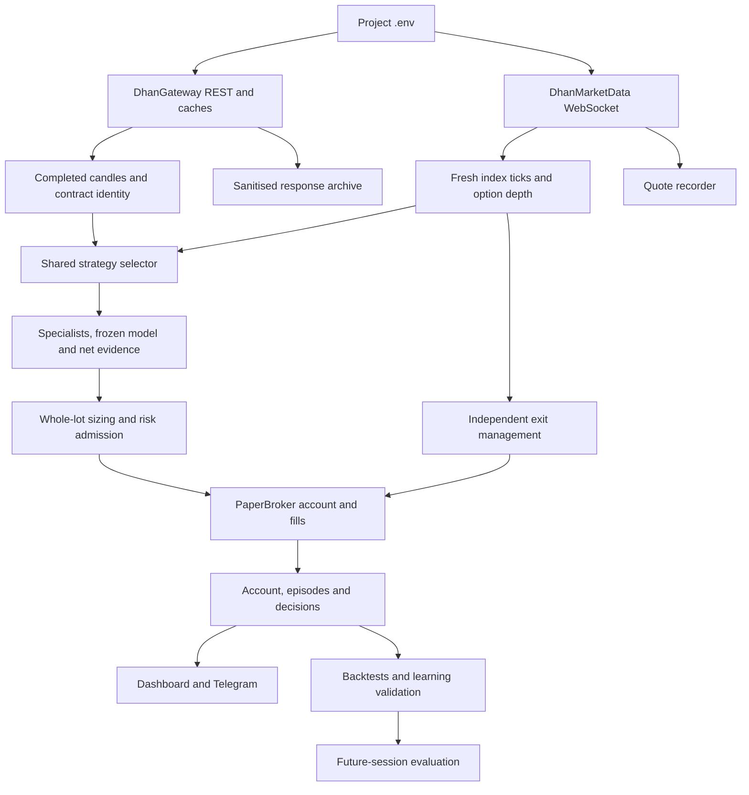

# NIFTY and SENSEX paper-trading system — implementation and operating plan

Updated: **2 October 2026**. All times are **Asia/Kolkata (IST)**. Project root: `E:\trading_bot_full`. Application root: `E:\trading_bot_full\Trading Bot`.

This is the consolidated specification of the implementation on disk, its observed deployment, evidence limits and remaining work. It replaces the accumulated update notes previously in this file. A feature being implemented, a test passing, a worker running and a strategy having a profitable edge are four different claims.

**Scope:** autonomous local paper buying of NIFTY and SENSEX options, one shared account, four competing setup hypotheses, causal multi-timeframe structure, the full returned option chain, dynamic position management, archived-input replay and guarded paper research learning. `PAPER_STRATEGY_MODE=autonomous` selects this implementation. The user does not choose a strategy or approve each paper trade. Real-money orders and autonomous code rewriting remain disabled.

## Contents

1. Operating contract
2. Architecture and ownership
3. Session lifecycle and credentials
4. Data acquisition and retention
5. Strategies and dynamic selection
6. Contract selection and sizing
7. Agent responsibilities
8. Protection, exits, recovery and P&L
9. Context, support/resistance and sweeps
10. Charts and dashboard
11. Backtesting and eligibility
12. Learning and activation
13. Telegram
14. Readiness and failure handling
15. Storage and API map
16. Run and verification commands
17. Validation/deployment snapshot
18. Remaining work and acceptance criteria
19. Source map and maintenance

## 1. Operating contract

These are current project requirements and paper-policy values, superseding older discussions of ₹800/₹850 daily loss, ₹750 trade risk or ₹20,000 monthly profit. The account is shared across both indices.

| Control | Value | Enforcement |
| --- | ---: | --- |
| Paper capital | ₹30,000 combined | Not ₹30,000 per index |
| Daily profit aspiration | ₹1,000+ net | Reporting objective; never forces entry |
| Monthly profit aspiration | ₹18,000 net | Latest user objective; does not increase size, frequency or holding time |
| Planned risk per lot | ₹650 maximum per lot | Stop distance, spread and estimated charges; position capped by remaining daily allocation |
| Correlated open risk | ₹650 × whole lots | Shared account; capped by remaining daily allocation |
| Planned daily loss allocation | ₹1,000 | Non-replenishing ledger; winners do not restore it |
| Execution reserve | ₹200 | Reserved for execution uncertainty |
| Daily loss / hard halt | ₹1,200 | Blocks entries and requests liquidation |
| Open positions | One | May contain multiple whole lots |
| Premium commitment | ₹24,000 maximum | Stricter policy inside capital cap |
| Cash reserve | ₹6,000 | Retained after entry charges |
| Session entry limit | Three | Persistent entry ledger |
| Losing-trade limit | Two | Further entries vetoed |
| Exit cooldown | Five minutes | Applied after exit |
| Weekly loss pause | ₹1,700 | Weekly lock resets at new ISO week |
| Account drawdown pause | ₹2,550 | Persistent account-level lock |
| Monitor / entry cutoff | 09:15 / 14:30 | Supported market sessions only |
| Liquidation request | 15:05 | Pending when no eligible fill is available |
| Telegram final report | 15:35 | Includes unresolved exposure |

A halt threshold is not a guaranteed realised-loss ceiling. Gaps, absent bids/depth, unavailable charges or process outages can prevent liquidation at the intended price. Expose pending exposure rather than invent a fill.

Dhan credentials have dedicated hot reload. Arbitrary risk/configuration edits are not promised to hot-reload. Restart deliberately after non-credential changes, inspecting open positions and pending exits first.

## 2. Architecture and ownership


```mermaid
flowchart TD
    ENV[Project .env] --> REST[DhanGateway REST and caches]
    ENV --> WS[DhanMarketData WebSocket]
    REST --> INPUT[Completed candles and contract identity]
    REST --> ARCH[Sanitised response archive]
    WS --> QUOTES[Fresh index ticks and option depth]
    WS --> REC[Quote recorder]
    INPUT --> SELECT[Shared strategy selector]
    QUOTES --> SELECT
    SELECT --> CHECK[Specialists, frozen model and net evidence]
    CHECK --> SIZE[Whole-lot sizing and risk admission]
    SIZE --> BROKER[PaperBroker account and fills]
    QUOTES --> EXIT[Independent exit management]
    EXIT --> BROKER
    BROKER --> DB[Account, episodes and decisions]
    DB --> UI[Dashboard and Telegram]
    DB --> RESEARCH[Backtests and learning validation]
    RESEARCH --> FUTURE[Future-session evaluation]
```

This is a responsibility map, not proof that all inputs exist or every candidate passes.

| Component | Responsibility |
| --- | --- |
| `DhanGateway` | REST, dated masters, caches, charge requests and credential refresh |
| `DhanMarketData` | Feed, subscriptions, freshness and credential-generation separation |
| `QuoteRecorder` / `DhanResponseRecorder` | Durable feed and supported REST archives |
| `AutonomousPaperEngine` | Active autonomous mode: four competing setups, full-chain context, independent position manager and paper research learner |
| `MultiStrategyPaperEngine` | Shared selector, preparation and context infrastructure; legacy three-strategy portfolio mode |
| `PaperEngine` | Shared data/quote/exit infrastructure; optional `orb_only` mode |
| `PaperBroker` | Sole primary account fill authority; cash, positions, charges and exit intent |
| `Store` | Serialised SQLite and atomic account/event bundles |
| `PaperResearchLearning` | Observed paper episode investigations, chronological fitting, independent replay validation and next-session paper filters |
| `LearningService` | Separate strict verified historical learning; research fees cannot pass its seven gates |
| `LearningMonitor` | Evidence audit; no order or promotion authority |
| `ForwardComparison` | Isolated baseline account for eligible frozen model comparisons |
| `AutonomousTradingAgent` | Research coordinator, performance observation and watchdog; not another trader |
| `TelegramNotifier` | Asynchronous notifications, no execution authority |
| FastAPI / React | Local APIs and presentation; browser is not the trading engine |

Autonomous mode has twelve engine workers: `paper-nifty`, `paper-sensex`, `paper-quotes`, `paper-engine`, `paper-feedback`, `paper-feed-watch`, `paper-selector`, `paper-protection`, `paper-protection-preparation`, `paper-context`, `paper-position-manager` and `paper-research-learning`. Feed, recorders and Telegram have additional workers. The preparation worker cannot override the protective worker. Worker count is not independent trading-agent count; the fourteen displayed specialist roles are recorded responsibilities.

## 3. Session lifecycle and credentials

| State/time | Behaviour |
| --- | --- |
| From 09:10 | Weekday supervisor can start missing backend; data warm-up can begin |
| Before 09:15: PREOPEN | No entries |
| 09:15–14:30: ENTRY_WINDOW | Monitor; warm-up, setup, depth, fees and risk still required |
| 14:30–15:05: MANAGE_ONLY | No new entries; continue position management |
| From 15:05: EXIT_ONLY | Request liquidation and retain pending-exit management |
| 15:35 | Queue closing report |
| WEEKEND / HOLIDAY | No entries or scheduled market-day start/end notifications |
| CALENDAR_UNSUPPORTED | No new entries outside supported years; retain position management |

Calendar source currently covers 2026 NSE derivatives closures as a shared portfolio gate. Independent BSE closures, special sessions and future years are not fully verified. The supervisor checks weekday/time and process availability; the engine checks the actual session gate. It does not terminate pending positions at 15:05.

09:15 starts monitoring, not immediate trading. Portfolio evaluation needs at least 20 completed session minute bars; range rejection needs at least 32. Opening-range retest and confirmation may delay entry further.

`Trading Bot/.env` is authoritative for `DHAN_CLIENT_ID` and `DHAN_ACCESS_TOKEN`. Credential-sensitive work checks for replacements; changes rebuild REST clients, advance generation, reconnect the feed and discard stale quotes. Old-generation results cannot authorise entry. For DH-901, inspect file freshness and runtime generations without exposing secrets. Configured credentials are not proof of provider acceptance. This reload mechanism does not imply automatic Telegram or risk-setting reload.

## 4. Data acquisition and retention

### Feed and candle inputs

- NIFTY/SENSEX ticker observations; option Full packets for executable book evidence.
- Underlying entry freshness: five seconds. Option book: two seconds. REST snapshots can seed display but are not executable depth.
- Normally up to 12 CALL and 12 PUT contracts per index, with exchange/security ID/expiry/strike/type/lot/tick identity.
- Completed index candles reach the selector before option-chain retrieval. Each index refreshes independently.
- Stale/gapped current sessions can trigger uncached repair, limited by index, generation and 30 seconds. Prices are not interpolated.
- Future rows are removed before features. Missing, duplicate, malformed or stale session bars reject affected setups.

`data/market_observations.db` stores whitelisted normalised observations, metadata, top-of-book and up to five supplied depth levels, LTP, volume/OI, timestamps and generation. It is not a raw packet dump or complete exchange order book. Queue capacity is 100,000, batch size up to 2,000, with WAL/checkpoints. Drops/errors/clean shutdown remain auditable. Zero application drops cannot prove zero upstream loss.

### REST responses and successive comparisons

`data/dhan_api_observations.db` stores sanitised compressed responses for supported shared-gateway chain, quote/depth, expiry, intraday/daily and expired-option calls. Successful chains retain all returned strikes before selection filters. This is not a claim that every arbitrary API or separate process is captured.

Archive fields include safe request parameters, endpoint, original receipt time, response/run IDs and generation. Credentials, headers, account/order payloads and free-text error bodies are excluded. Failures/discarded generations retain outcome metadata. Cache hits do not become new observations or reset field age.

Chain comparisons require same underlying, segment, expiry and generation, plus matching security ID/strike/type. Valid same-session baselines survive restart. Missing, overnight, future, identical-time or ambiguous baselines give no comparison. Long gaps are flagged; negative cumulative-volume changes are resets/corrections, not selling volume.

The UI separates previous-day OI changes from changes since the last response. Price/book/volume/OI/IV/Greek changes are research evidence, not identified institutional buying, writing or signed dealer gamma. New HTTP receipt does not prove exchange OI changed.

The project `.env` now sets `MARKET_OBSERVATION_MAX_BYTES=53687091200` (50 GiB); the code fallback remains 10 GiB. This allowance applies separately to each recorder's archive, not to the whole project. Free-space protection remains active and no archive is silently deleted at the limit. Bounded queues and disk errors can make capture incomplete. Exits must continue when research recording fails.

Successful Dhan brokerage calculator responses retain their original request fingerprint, fixed contract identity and capture time in `broker_fee_receipts`. Content-addressed receipt keys preserve successive quotes when the one-hour refresh cache replaces an older value. A one-time snapshot retained 1,732 existing calculator receipts without changing their dates or evidence grade. These are broker estimates, not actual executed transaction charges.

## 5. Strategies and dynamic selection

Active policy version: `autonomous-paper-v1`. All four setups evaluate both indices against completed one-minute candles; they share one account. Parameters are explicit engineering hypotheses, not statistically proven optimal values. Legacy `simple`, `portfolio` and `orb_only` modes remain available for comparison and their old reports are not relabelled as autonomous results.

| Hypothesis | Version | Confirmation | Horizon |
| --- | --- | --- | ---: |
| Trend continuation | `autonomous-continuation-v1` | ADX ≥20, aligned EMA9/21 and directional EMA21 slope ≥0.05 ATR; completed continuation with bounded ≤2 ATR extension | 30 min |
| Opening-range retest | `autonomous-orb-retest-v1` | 09:15–09:30 range, buffered break, later retest and separate resumption | 45 min |
| Trend pullback | `autonomous-trend-pullback-v1` | ADX ≥25, EMA9/21 alignment/slope, pullback near EMA21 then resumption; no overextension | 30 min |
| Range rejection | `autonomous-range-rejection-v1` | ADX ≤20, flat EMA21, prior 30-bar range ≥2 ATR, boundary rejection and confirmation with sufficient room to midpoint | 10 min |

TREND_UP/DOWN prefer pullback, continuation, then ORB; RANGE prefers rejection; VOLATILITY_EXPANSION/TRANSITION prefer ORB. Every setup is evaluated. The current completed bar must still confirm the exact pending signal; in-place candle corrections invalidate cached analysis. Preference cannot bypass eligibility.

Ranking considers supported matching net evidence/strength, regime preference, net target reward/all-in risk, spread and stable tie-breakers. It is not profit probability. Sufficient nonpositive evidence can veto entry. Insufficient evidence is allowed only in authorised unvalidated paper-observation mode.

A downtrend alone is not a PUT entry. Timely setup, eligible contract, protection candle and affordable risk are still required. A whole no-trade day is valid.

## 6. Contract selection and sizing

```text
Readiness → Scanner → Regime → Setup → Confirmation → Option Selector
          → specialist review → frozen ML → net economics/evidence
          → shared risk → latest-input recheck → atomic paper fill
```

This is a logical dependency order; evidence can be prepared asynchronously. Approval is not a fill. Pending signals retain the original 185-second maximum lifetime. Feature refresh does not renew age or move original invalidation.

### Screen: option-buyer-v1

- Fixed identified contract at eligible expiry; expired and same-day expiry excluded.
- ATM allowed. Prefer absolute Delta 0.45–0.60; 0.30–0.45 needs aligned directional trend.
- Correct Delta sign, age ≤120 seconds; missing/future Greeks fail.
- Positive valid book, volume/OI, lot/tick, required universe and depth.
- Spread `(ask − bid) / midpoint`: maximum 2%; ≤1% preferred.
- Preferred Delta/liquidity within nearest eligible expiry; cheap premium alone is not a rule.
- Planned net reward/risk floor 1.0 after charges; nominal target 2R before costs. Strict net-2R is a separate comparison, not manufactured by extending a target.

Autonomous protection requires the exact selected contract's completed signal/retest-minute candle and at least fourteen causal contract bars for option ATR. The stop respects that candle's low and a minimum observed option-ATR distance; it is not a hardcoded percentage. Live day-low metadata cannot overwrite this candle. Never tighten a stop to fit the risk allowance. Reject any quantity exceeding its ₹650-per-lot ceiling or the remaining daily allocation.

Before entry, the nominal 2R premium target must have room before the nearest already-confirmed higher-timeframe obstacle. The observed Delta maps premium distance to an approximate index move; this is explicitly a local sensitivity approximation. A range midpoint must also offer enough room. The target is never extended or the stop reduced merely to pass the gate.

### Sizing: risk-sized-whole-lots-v3-per-lot

```text
cash allowance = min(₹30,000, premium limit, cash − cash reserve)
risk allowance = min(per-lot trade/correlated cap × whole lots, remaining daily allocation)
unit risk = ask − structural stop + max(0, ask − bid)
entry debit = quantity × ask + estimated entry charges
planned risk = quantity × unit risk + round-trip stop charges
quantity ≤ observed bid quantity and ask quantity
```

Choose the largest whole-lot quantity passing recorded broker fee estimates and both allowances. Autonomous runtime and archived-input replay use the same sizing helper and paper broker. Broker rechecks account, full quantity/depth, contract, quote, fees and review atomically. Charge HTTP requests occur outside the account lock; after their completion, admission rechecks current quotes and risk. Multi-lot permission does not remove the one-position limit.

The ₹650 allowance applies per lot. Two lots have a ₹1,300 ceiling, but the unchanged ₹1,000 planned daily loss allocation caps their actual admissible risk at ₹1,000 before any loss spend. A two-lot position with ₹840 all-in planned risk is eligible on sizing; one with ₹1,100 is rejected. Winners do not refill spent daily allocation. Outcomes from the earlier whole-position cap have a different sizing version and are not pooled as evidence for the current policy.

Autonomous paper filters require the current policy and feature schema, replay the actual sizing rules, and compare identical archived-input and risk/execution-setting digests. The separate legacy verified ML path has its own scope/governance limits and is not activated in autonomous mode.

## 7. Agent responsibilities

The eight workflow stages are Scanner, Regime, Setup, Confirmation, Option Selector, EV, Risk and Execution. They are implemented checks/telemetry, not independent LLM traders.

Fourteen specialist roles are recorded under `specialist-review-v2`:

| Role | Task | Authority/learning boundary |
| --- | --- | --- |
| Regime | Current trend/range compatibility | Deterministic veto |
| Directional | Side, setup price and invalidation relationship | Deterministic veto |
| Momentum | Completed-bar age, finite ADX/EMA/slope, alignment | Deterministic veto |
| Structure | ATR, invalidation, target room, extension; attach levels/sweeps | Required setup checks; new zone context not independently validated |
| Liquidity | Fresh book, spread and minimum lot depth | Veto; sizing/broker check full quantity |
| Adversarial | Contradictions and invalid net economics | Binding challenge, not independent predictor |
| Options Flow | Unsigned OI/volume/chain changes | Advisory |
| Gamma | Fresh contract gamma | No dealer inventory inference |
| Theta | Daily decay only with verified units | Otherwise unavailable |
| IV | Fresh IV/research context | Comparable-expiry percentile absent |
| News/Event | Event-feed availability | No validated timestamped feed; unassessed |
| Loss Investigator | Completed-loss classifications/hypotheses | Post-trade; no strategy rewrite |
| Risk Sentinel | Budget, session, exposure and persistent locks | Cannot be outvoted or learned |
| Orchestrator | Consolidate checks into WAIT/CALL/PUT candidate | Passed stages are not confidence |

Missing required evidence blocks candidates; optional missing context remains unavailable. Counts do not prove learning. No individual role rewrites code or changes risk. Selector proposes, risk admits, broker mutates account. Research coordinator direct entry/exit methods reject use; its `dynamic_params` are explicitly not applied to execution.

## 8. Protection, exits, recovery and P&L

### Protection and exit order

Portfolio positions use `adaptive_observed_v1` around structural protection. Ordered checks: risk halt, premium stop, underlying structural failure, session liquidation, adaptive request, underlying target, holding horizon, premium target.

Autonomous position management runs every second, independently of the selector. Two completed post-entry bars with opposing EMA21 price relation and opposing EMA9/21 alignment can request `COMPLETED_TREND_REVERSAL`. Otherwise the engine holds while the existing bid-based stop, cost-covering/trailing rules, structural invalidation, target, horizon and session controls remain active. Context/learning failure cannot widen a stop or suppress this protective worker.

Adaptive logic can request a cost-covering stop after a one-R favourable move. With completed same-contract option ATR, trailing begins after 1.2R, using 0.5 ATR before 13:00 and 0.35 ATR afterwards. Five-bar stall detection can request `MOMENTUM_STALL`. Missing option ATR withholds trailing/stall logic; no index ATR or guessed volatility substitutes. Quote gaps invalidate continuity. Stops remain requests, not guaranteed fills.

### Durable exit workflow

Before a close attempt, persist `exit_request` on the position and in `exit_requests`: ID, original reason/time, attempt count/time, remaining quantity, status and error. The independent protective worker records the 15:05 intent even when no fresh bid exists. Preserve the original reason on retry even when a later condition differs.

Fresh bid quantity can support partial whole-lot liquidation. Reusing a consumed quote cannot fill again. Remaining exposure stays visible. PENDING/PARTIAL/COMPLETED changes persist together with fills/account state.

Failure retains the request and halts entries. Restart reconstructs positions and resumes the request. Only an exit-pending technical halt may clear automatically after the position is durably flat with no loss-ledger lock. Manual and risk halts remain in place. A stale exit/protection worker error clears only after the account is flat and persistence is healthy. Partial exits reduce remaining price/spread risk but retain original charge reserve. Legacy positions without metadata retain conservative reservations.

### P&L

Dhan does not supply paper P&L. It is calculated locally:

- Entry at eligible observed ask; exit at eligible observed bid.
- Closed gross = `(exit − entry) × closed quantity`.
- Net subtracts allocated entry/exit charges once.
- Open gross needs fresh bid; net liquidation additionally needs remaining entry charges and exit estimate.
- Unavailable liquidation means unavailable target progress, not zero or stale executable valuation.
- Orders, partial fills and completed episodes are different. Executed performance uses completed episodes; candidates/rejections are not trades.
- Keep causal features, versions, context, reasons, times and available MAE/MFE evidence.

Broker-calculator runtime charges are still estimates for simulated execution. `costs_estimated` does not imply an invented exit: an actual captured-bid paper fill has `estimated_exit=false`. This distinction allows explicit paper research while leaving strict verified historical gates intact. Final fill P&L is included in MAE/MFE observations. Dated historical schedules/receipts have separate validation. Calculator provenance does not turn paper execution into actual exchange fills.

## 9. Context, support/resistance and sweeps

### Advisory market context

`paper-context` collects roughly once per minute in entry/management sessions, outside the protective exit heartbeat.

| Context | Implementation and limits |
| --- | --- |
| Futures VWAP | Identified nearest unexpired futures; completed minute HLC3 × actual volume. Compare futures close to its own VWAP, not unadjusted spot. Minute-bar proxy, not exact trade VWAP |
| Positioning | Autonomous mode analyses all returned contracts that map to fixed current metadata for one eligible expiry, including strikes outside the old ATM±5 window. Both sides must be present; unmapped/missing pairs and original receipt age remain visible. Legacy portfolio retains its narrower window. OI/PCR are related observations, not independent votes |
| Movement scale | Same-index ATM call/put IV × `sqrt(minutes / (365 × 24 × 60))` × spot; capped by horizon/time to 15:05. Uncalibrated scale, not expected profit |
| Freshness | Original receipt time retained. Context expires after 120 seconds/generation change; futures bars have separate 180-second limit |
| Persistence | Inputs/comparisons in `market_context_inputs`, derived `market_context`; retain decision-time snapshots on signals/positions/episodes |

No AI sentiment nudge, automatic CALL+PUT entry, signed dealer-gamma model or institutional-flow claim is introduced.

Fresh full returned fixed-contract chain context is mandatory for an autonomous offer. Selected-contract OI, option volume, current depth, Delta, spread, structure and net economics also gate admission. Missing validated news, comparable IV percentile or signed dealer position data is displayed as unavailable; it is not inferred from OI or replaced with a guessed sentiment score.

### Multi-timeframe zones

Separate NIFTY/SENSEX maps cover 2m, 5m, 15m, 30m, 1H, 2H, 4H and full-session daily bars, anchored at 09:15.

- Complete contiguous candles only. Daily needs 375 minutes. Full 4H is 09:15–13:15; remaining 135 minutes is not a full 4H confirmation candle.
- Swings require two completed bars on each side; availability begins after the second confirming bar closes.
- 2m–30m pivots stay within session; 1H–4H/daily can span valid session slots. Missing bars/days do not become adjacent observations.
- Width uses 10% of trailing mean candle range at pivot plus a price-relative floor. A heuristic, not verified institutional structure.
- Keep latest 24 confirmed zones per timeframe; prior full-session high/low and opening range are separate references.
- Sweep hypothesis requires strict breach of an already available zone, close back beyond the whole zone, then completed minute close beyond the sweep candle's opposite extreme. Examine last ten confirmation minutes. Hidden stops are not observed.

Trading maps use seven calendar days of history; the terminal uses 365. A chart 4H level can therefore be absent from the trading map. Chart history is not automatically new causal strategy input. Restored maps are stale until refreshed. Calendar limitations also constrain multi-session structure claims.

## 10. Charts and dashboard

Primary views: Dashboard, Agentic view, Backtest results, Charts. Light/dark themes, black dark background; secondary diagnostics and research controls are expandable.

### Terminal

`#charts` uses lazy-loaded TradingView Lightweight Charts, not an embedded broker account. `GET /api/market/chart/{symbol}?period=5m` merges retained index history, engine frames and observed ticks. It is read-only and does not order/download on every poll.

- 2m/5m/15m/30m/1H/2H/4H candles; six-month/year history choices.
- Crosshair, pan/time zoom, fit/latest, price-number wheel zoom; `Auto price` resets vertical scaling.
- Selectable structure layers, 4H initially on. Default five nearest bands per side/timeframe, ten/all-retained alternatives.
- Deduplicate exact bands within timeframe, preserve cross-timeframe evidence. `Fit zones` includes selected bands. Crowded +N labels retain individual evidence cards.
- Reference bands span viewport, with confirmation marks explaining they were not known earlier. Replay cannot use them before confirmation.
- Recorded futures-volume histogram shows identity/expiry/coverage and numeric crosshair values. Not cash-index volume or fabricated continuous futures.
- Paper markers use recorded times, not option premium as index price.
- Two-second non-overlapping refresh; history/structure cache up to 30 seconds. Data age remains separate from refresh time.

`python -m app.chart_history` explicitly requests 365-day index history in up-to-90-day chunks and up to 90 days for nearest unexpired futures. Actual coverage may be shorter/gapped. Retain dated identity locally. A year of index candles does not imply a year of matching option data.

### Workflow and backtest views

NIFTY/SENSEX selects displayed evidence. Workflow zoom/percentage changes diagram scale, not confidence. Animations represent recorded state/dependencies, not measured communication throughput or learning. Keep current review, past activity and missing inputs distinct.

Dashboard prioritises P&L/exposure/risk. Agentic includes specialists, learning registry/audit, levels/sweeps/outcomes and decisions. Backtests show selected report coverage and grade.

`Full run` and year buttons filter that report's chart; they do not start backtests or create missing years. Deterministic repeated runs may match P&L; portfolio may match its only selected strategy. Repeated display is not additional economic evidence. Deduplication is required for outcome aggregation regardless of history presentation.

## 11. Backtesting and eligibility

**Active autonomous replay:** `source=observed`, `strategy_mode=autonomous` runs `ReplayEngine(AutonomousPaperEngine)` with a virtual clock, archived normalized index/depth events and sanitized Dhan responses. It calls the same selector, contract protection, sizing, shared paper broker, position manager and protective exit policy as runtime. It makes no HTTP or broker order requests and publishes no replay events to the live UI bus.

Only responses received by replay time are visible. Completed-bar checks still remove future candles. Contract candles, full-chain Greeks/OI and fixed metadata must actually have been captured. Saved same-day broker prequotes provide explicitly estimated conservative fee scenarios; missing fees block admission. A warm-up response is not an exchange observation from the requested session.

Replay reads fee receipts in one indexed batch from the permanent journal and legacy cache. A later receipt cannot supply fees to an earlier decision. Multiple warm-up responses for one index at the same replay tick produce one final structure calculation before decisions run; this preserves the latest causal frame while avoiding repeated startup calculations.

Only reconstructable replay databases use SQLite WAL with `synchronous=NORMAL`. The primary paper ledger retains its original `FULL` setting. A local 100-commit check took 12.2 seconds with FULL and 1.2 seconds with NORMAL; this is an I/O measurement, not a whole-replay speed guarantee. Power-loss interruption requires rerunning an incomplete replay before accepting its report. Final replay closure checkpoints the ledger before the calling job saves completion. See [SQLite's synchronous documentation](https://www.sqlite.org/pragma.html#pragma_synchronous).

Each run uses an isolated `data/autonomous_replays/<run-id>/account.db` and saves `report.json`. The primary account, balances, Telegram and live decision stream remain untouched. Reports include requested/observed range, policy, estimated charges, daily net P&L, pending exposure, admission blockers, input digest and risk/execution-setting digest. Missing sessions are reported as missing, not zero-profit observed sessions.

The UI's archived-input choice defaults to seven days. This cannot fabricate five years of option depth/OI/Greeks. Incomplete recordings, missing policy/subscription evidence, fee receipt times or unresolved exits yield `research_partial`. A completed research replay is still unvalidated paper evidence, never verified exchange performance.

| Path | Useful for | Does not automatically establish |
| --- | --- | --- |
| Fixed-contract CSV/replay | Causal strategy comparison with dated identity/costs/coverage | Real queue priority, unseen depth or full runtime parity |
| Recorded observed session | Contracts/observations actually captured | Complete exchange stream or real fills |
| Dhan rolling expired options | Broad historical research | Continuous held identity, dated lot/fee/depth/Greek provenance |
| Synthetic/average prices | Quarantined labelled demonstrations | Verified performance, training or promotion |

Dashboard/CLI/observed-session jobs share risk/session configuration. Exact-contract paths default to current screen; rolling uses explicit legacy screen. Preserve scope/configuration, input fingerprint, quality, status, costs and coverage.

**Legacy parity gap:** older candle/rolling replay can still restrict quantity to one lot and lacks complete specialist/Greek/two-second depth parity. The new archived-input autonomous replay shares multi-lot runtime sizing. Old reports do not validate the active autonomous policy merely because strategy names match.

The legacy research coordinator's daily rolling ORB job is not started in autonomous mode. The active research worker investigates new completed paper episodes and, after sufficient evidence, requests independent baseline/challenger replay outside the entry/management session. Manual archived-input replay is available through the Backtest results view.

### Seven strict historical training gates

| Gate | Required evidence |
| --- | --- |
| Quality | `quality = verified` |
| Completion | Complete; current gate defaults omitted report status to complete |
| Issues | No report issues |
| Exits | No unresolved exits/positions |
| Provenance | Fixed security ID, dated metadata, exchange/expiry/strike/lot/tick and non-synthetic prices |
| Net result | Finite reconciled gross/cost/net and matching sourced dated schedules or valid per-side receipts |
| Causal features | Expected schema, at least six finite values and valid feature/entry/outcome timing |

Additional checks reject synthetic input, partial/excluded trades, invalid timing and repeated position rows. Cost receipts cannot remove another learning exclusion. Research/estimated-cost results can remain ineligible even when complete.

The previous 195-trade example is historical, not a fresh run. `research_net`/`research_partial`, rolling identity and estimated costs failed despite causal features and resolved exits. Zero passed all seven gates; no model fitted/promoted from that report.

Metrics include net/gross return, charges, drawdown, profit factor, payoff/break-even descriptive statistics and exit/holding distributions. These describe the report's actual scope; they do not imply calibrated odds or that an alternate exit would perform better.

## 12. Learning and activation

### Active autonomous paper research

`PaperResearchLearning` is separate from strict verified historical learning. A paper fill based on captured bid/ask can be useful for paper research even though its charges are estimated. It never gains `quality=verified`, live eligibility or risk authority through this path.

Eligible completed episodes must belong to `autonomous-paper-v1`, have fixed security ID/metadata, recorded entry and exit quote identities, completed observed exits, reconciled gross/estimated-cost/net results, and active-policy causal feature timestamps preceding entry. Legacy/synthetic/rolling/future-feature outcomes are rejected with visible reasons. Existing old reports and trades are preserved; they are not relabelled to fill a minimum sample.

The learner uses the original twelve causal features plus full-chain PCR and matched OI changes, confirmed-zone room relative to ATR, observed futures/VWAP relation, index, declared holding horizon and four strategy indicators. It excludes future price, exit P&L, MAE and MFE from entry inputs. Missing inputs are explicit; model imputation includes missingness indicators.

1. New completed episodes produce stored outcome investigations. Classifications include planned loss, favourable move reversed, move did not develop and execution/gap overrun. They are hypotheses rather than proof of causation; a loss never authorises wider risk or automatic source-code edits.
2. Training is serialized. At least 60 train outcomes, 30 chronological holdout outcomes and 34 distinct completed days are required. Before 15:35, the current day is not treated as a completed training session. Fixed regularized logistic regression and a 0.55 threshold avoid searching many rules against the same holdout.
3. A used holdout cannot be retried as new evidence. At least ten fresh holdout days and enough new outcomes are needed for another candidate. Previous holdout observations may later join training only when validation moves to future dates.
4. Post-hoc filtering must retain at least thirty outcomes and half the baseline, have a positive paired daily improvement lower bound, and remain net positive with doubled estimated charges. Passing this screen means `AWAITING_FULL_ACCOUNT_REPLAY`, not approval.
5. Baseline and challenger must replay the same independent dates with identical archived-input and risk/execution digests through the entire shared account. Require full observed session coverage, no issues/pending exits, at least thirty outcomes on each path, at least ten paired days, positive improvement lower bound, positive doubled-fee challenger net and no worse drawdown.
6. A passing model is automatically eligible for **paper entry filtering** from the next calendar day, then freezes for the whole session. The actual market calendar still controls entry. Artifact policy, algorithm, feature schema, dimensions and threshold must match. No intraday model switching or risk changes are permitted.

Without an approved filter, the engine remains in `BASELINE_PAPER_COLLECTION`: it can take authorized paper trades through all market/risk gates, but shows no invented probability or learned improvement. A model score, if present, predicts its declared paper outcome label; it is not a calibrated market direction or target-before-stop probability.

The Dashboard and Agentic view expose `/api/autonomy`: active policy, strategy set, monthly net objective, HOLD/EXIT reasoning, eligible evidence, independent days, model state, candidates and investigations. The fourteen specialist roles are contextual checks; they do not each retrain themselves. The paper entry filter is the adaptive component. Protective stops/trailing rules and risk/session caps remain deterministic.

### Separate legacy verified learning and review

Decisions, reasons, contexts, episodes and research accumulate. Fixed roles do not learn because counters increase. Regime/evidence-dependent ranking is dynamic evaluation, not automatic code rewriting or proof of improving returns.

Two legacy activation mechanisms must be distinguished from the active paper research path:

1. **Rule registry:** `Store.active_learning_policies()` requires validator version 4, PROMOTED status, named/time-stamped review, effective date and expiry. Risk/sizing/protection cannot be promoted by that review. Default portfolio currently freezes empty legacy `pipeline.policies`; registry presence is not proof of use.
2. **ML entry models:** `LearningService` uses `learning_guard_v3`, champion/model records and daily `ml_sessions`. Qualifying full replay can automatically schedule `VALIDATED_PENDING_SESSION`. Freeze checks guard/version/dates/expiry, not the rule registry's named human review. This is an unresolved governance difference if every activation is meant to require review.

These mechanisms remain available in legacy modes and the research archive. Autonomous mode does not start the legacy learning monitor, research coordinator or forward comparison worker. Their historical counts do not describe active paper research learning. Their governance/scope limitations still matter before any future live deployment.

### Training and validation

- Schema `entry_features_v1`: ADX, ATR%, VWAP distance, relative volume, EMA slope, session minute, Delta, spread, RSI, stop%, option ATR%, side. Missing fields remain explicit.
- Group eligible outcomes by scope, deduplicate and sort chronologically.
- Effective constants: **34 distinct sessions**, purged 70/30 day split, **60 train trades**, **30 test trades**, both classes in training. Defined in `learning_validation.py`; configuration field names alone do not override them.
- Reserve holdout scope/dates before fitting; reuse is not new evidence. Failed training does not release consumed holdouts.
- Fixed regularised logistic model/threshold; assess selected outcomes, Brier metrics, sample/loss/session counts, profit factor and expectancy.
- Filter-only success needs full account replay: cash, sizing, locks, fees, exits and matching sessions including no-trade days.
- Guard requires complete verified evidence, reconciled daily results, at least 30 trades per replay and ten holdout sessions, positive attempt-adjusted paired improvement bound, positive candidate net P&L and no worse drawdown.
- Successful scheduling is no earlier than next calendar date, expires after 30 days and freezes by day. Actual entry still needs valid market session; no intraday model switching.
- No matching model: `NO_VALIDATED_MODEL`, no probability, baseline paper observation can continue through other gates. Present but expired/invalid model fails its check.

The legacy coordinator's hourly research behaviour applies only when that legacy mode is running. Autonomous paper research polls for new outcomes every thirty seconds on its own worker and runs account replays only outside entry/management hours. Research latency cannot occupy the independent exit worker.

`ForwardComparison` uses an isolated fixed baseline when a validated frozen model exists, audits coverage and records comparable sessions. Its P&L is not added to primary account. Completion alone does not establish improvement.

LLM/OpenRouter analysts summarise evidence/trades/failures and propose hypotheses. No independent trade/risk/self-promotion authority; outside protective exit path.

### Probability evidence

`outcome_evidence.py` separates fixed-horizon index direction (±0.02% flat band), original premium barrier order and actual net exit. Ambiguous intrabar order, missing paths and earlier adaptive exits are distinct. Labels appear after entry decisions/outcome availability.

Verified matching outcomes are economically deduplicated. Use first matching trade per distinct session and at least 30 sessions before displaying historical frequencies with 95% Wilson intervals. That is a display floor, not calibration. Missing/ambiguous paths withhold target/stop frequencies.

EMA agreement and zone location are not probabilities. Selected-trade frequencies do not forecast every candle/zone. No validated directional or zone-response probability model is established.

## 13. Telegram

Queue market start from 09:15, entry after durable fill, position/P&L approximately every two seconds only while confirmed open, confirmed exit details, and a 15:35 report with trades or detailed persisted no-trade reasons.

Daily checkpoints prevent ordinary restart re-enqueueing; late startup skips obsolete start messages. Queue acceptance is not guaranteed exactly-once external delivery. Network/Telegram failure and queue drops remain visible and never delay protective exits. Values come from local paper P&L, not a Dhan live position.

## 14. Readiness and failure handling

`/api/health` separates app response, execution health, feed/recorders and trading readiness. Supervisor `app = healthy` is weaker than readiness.

- Engine health: fresh heartbeat, live workers, broker persistence and operational errors. Entry rejection remains auditable without a permanent operational latch.
- Entry readiness: session, enabled/halted account, existing position, feed, quote-recorder availability and per-index candles/index freshness/option depth.
- At least one index must have data. Preliminary readiness is not setup approval; nonempty candle frame alone does not establish complete valid session data.
- API-response recorder has separate health. Failure invalidates research coverage; current readiness explicitly gates the quote recorder, not every research service.
- Exit: NO_POSITION / EXECUTABLE / WAITING_FOR_DEPTH, with held-contract freshness, minimum lot depth, full-quantity coverage and saved requests. EXECUTABLE is not a completed fill or full fee check.
- Paused entries never disable protective exit management. Failed persistence restores committed state and blocks admission. Reconnect/rotation invalidate stale observations.
- Advisory/learning/UI failure cannot grant trading authority.
- Expected protection-data gaps have `WAITING_DATA` reviews; insufficient structural target room has a `BLOCKED` review. These no longer throw through the selector as code errors. Unexpected exceptions retain `ERROR` evidence and cannot create an offer.

The existing feed-watch worker runs component-specific recovery checks roughly every two seconds. It reloads authoritative credentials independently of the main execution cycle, restarts stopped workers without duplicating running workers, restarts stopped quote/notification recorders, retries the committed account write and reconnects the feed through provider backoff. One repair exception does not prevent later component repairs. Candle and chain workers retain their existing refetch loops; the monitor verifies current completed candles and observed chain context during the market session. A retry is not proof of recovery, and unknown persistent code errors remain blocked until repaired.

`engine.recovery` and Agentic view's Automatic recovery panel show current checks, failure category, attempted action and attempt count. Dashboard System & risk details also shows the current recovery state and last check. The latest fifty state/attempt events persist in the existing database under `paper_recovery/status`. Restart restores history but begins current checks at `STARTING`. Unchanged failures during backoff do not flood history. Recovery journal failures are advisory; the account persistence gate remains mandatory. Account and recovery writes have bounded Python-lock and SQLite waits, so a slow research write cannot indefinitely hold the exit worker.

The existing single-instance supervisor checks execution and protection heartbeats independently. A stale execution worker while flat, or a stale/dead protection worker while occupied, can trigger a restart of its owned API after three qualifying checks and a read-only validation of the committed paper ledger. The endpoint reports `degraded` for stale workers; that response remains eligible for watchdog inspection. An owned API unresponsive for sixty seconds is also recoverable after a ninety-second startup grace. The old process tree must terminate before a replacement starts. Restarts are limited to three per hour, at least five minutes apart, with the restart budget and bounded diagnostic history retained in `backend/.paper_service.status.json` and exposed by `/api/health`. Unowned APIs, unreadable ledgers and mere missing market data never authorize a watchdog restart. Restored positions and pending/partial exit requests remain in the original account; new fresh observed depth is still required to fill. A held-contract feed can reconnect between the 15:05 liquidation request and 15:30 market close, including when other subscribed contracts still have fresh data. After close, unavailable depth remains pending rather than producing an invented exit.

Incoming feed books reject nonincreasing/invalid sequence values when supplied, missing previously observed sequences, and regressing/missing previously observed last-trade times. Sequence baselines reset per connection; equal last-trade times remain valid because book changes need not include a trade. Rejected packets are archived diagnostically but cannot overwrite the executable book or refresh its receipt timestamp. A reconnect clears executable quotes; the selector does not fall back to a copied pre-reconnect book. Dhan's documented Full feed and installed SDK provide no exchange sequence or book-update timestamp, so missing sequences in that feed are explicitly unverified rather than a universal entry veto. Receive-age gates do not prove exchange freshness. Paper broker health describes the top-of-book fill assumptions and the absence of latency, queue, competing-consumption and market-impact modelling.

Windows Task Scheduler currently uses an interactive user logon. WakeToRun/StartWhenAvailable do not establish operation after logout, host shutdown or network failure. Unattended service deployment remains an operational prerequisite; the bot's guarded paper observations and recorded P&L remain unvalidated trading evidence.

System & risk details exposes readiness blockers; positions show exit requests. Historical counts, current liveness, repair attempts and current data freshness remain separate. These mechanisms repair tested runtime failures, not arbitrary source code or trading losses. Complete market-session operation and profitable forward performance remain separate acceptance criteria.

## 15. Storage and API map

| Project location | Contents |
| --- | --- |
| `Trading Bot/.env` | Authoritative credentials/settings; never publish values |
| `Trading Bot/backend/trading_bot.db` | Account/orders/episodes/decisions/exits, ledgers, reports, caches, learning and notification checkpoints |
| `Trading Bot/data/market_observations/*.db` | Normalised feed observations by recorder run; legacy `market_observations.db` is also readable |
| `Trading Bot/data/dhan_api_observations.db` | Sanitised supported REST responses |
| `Trading Bot/data/` | Historical datasets, manifests and research/report artefacts |
| `Trading Bot/data/autonomous_replays/<run-id>/` | Isolated replay account and report; never the primary paper account |
| `.tmp/` | E-drive tests, logs, caches and dependency wheels |
| `graphify-out/` | Graph JSON/HTML/report/backups |

Record namespaces include `paper_learning_state`, `paper_learning_candidates`, `paper_learning_sessions`, `paper_investigations`, `broker_fee_receipts`, `session_models`, `ml_sessions`, `ml_runs`, `ml_models`, `ml_champions`, `decision_reviews`, `exit_requests`, `market_context_inputs`, `market_context`, `market_structure`, `market_outcomes`, `chart_futures_contracts`, `forward_sessions` and `policy_audit`.

| Read-only endpoint | Purpose |
| --- | --- |
| `/api/health`, `/api/risk`, `/api/mode` | Readiness/health, limits, paper mode |
| `/api/dashboard`, `/api/positions`, `/api/paper/trades` | Account/current outcomes |
| `/api/strategies`, `/api/agents`, `/api/decisions` | Evaluations/reviews/stages |
| `/api/autonomy` | Current autonomous policy, management, paper research evidence and model state |
| `/api/market/chart/{symbol}` | Terminal projection |
| `/api/market/observations/{identifier}` | Saved feed observation |
| `/api/market/responses/{identifier}` | Saved response; missing/not-yet-persisted IDs return 404 |
| `/api/learning`, `/api/learning/model` | Rule registry and separate ML state |
| `/api/learning/monitor`, `/api/learning/forward` | Audit and isolated comparison |
| `/api/backtest/history`, `/api/backtest/jobs`, `/api/backtest/reports/{identifier}` | Jobs/reports |
| `/api/telegram/status`, `/api/agent/status` | Notification/research health |

POST pause/resume/halt, download, research, backtest and review endpoints mutate state. Keep loopback binding; this interface is not a reviewed public multi-user deployment.

## 16. Run and verification commands

### Windows CMD — backend

Check that another backend is not listening before starting another instance:

```bat
cd /d "E:\trading_bot_full\Trading Bot"
set "TEMP=E:\trading_bot_full\.tmp"
set "TMP=E:\trading_bot_full\.tmp"
set "PYTHONDONTWRITEBYTECODE=1"
run_backend.bat
```

The launcher locates `backend` relative to itself, invokes the local venv Python and starts Uvicorn on `127.0.0.1:8080`. It sets temporary files under the E-drive project and disables Python bytecode writes.

For WinError 10048 use `netstat -ano | findstr :8080` and inspect `/api/health`. Do not start a duplicate or kill an unidentified PID. Inspect pending exits before controlled restart. `backend/paper_service.py` is a single-instance supervisor; code existence does not prove Task Scheduler setup or that the PC stays awake.

### Windows CMD — frontend

```bat
cd /d "E:\trading_bot_full\Trading Bot"
set "TEMP=E:\trading_bot_full\.tmp"
set "TMP=E:\trading_bot_full\.tmp"
set "npm_config_cache=E:\trading_bot_full\.tmp\npm-cache"
run_frontend.bat
```

The launcher sets project-local temporary/npm-cache paths, runs `npm ci` only when Vite is absent, then starts `npm run dev`. Open `http://127.0.0.1:5174/`. The browser can close while backend continues; host power, network and E-drive access are necessary.

### Explicit chart backfill

```bat
cd /d "E:\trading_bot_full\Trading Bot\backend"
set "TEMP=E:\trading_bot_full\.tmp"
set "TMP=E:\trading_bot_full\.tmp"
.venv\Scripts\python.exe -B -m app.chart_history
```

This requests provider data and writes caches; do not run on every browser refresh. Check returned coverage rather than assume the requested period was delivered.

### Verification

```bat
cd /d "E:\trading_bot_full\Trading Bot\backend"
set "TEMP=E:\trading_bot_full\.tmp"
set "TMP=E:\trading_bot_full\.tmp"
set "PYTHONDONTWRITEBYTECODE=1"
.venv\Scripts\python.exe -B -m pytest tests -q --basetemp "E:\trading_bot_full\.tmp\verification-tests"
```

Use a disposable `--basetemp`; pytest manages its contents. In `Trading Bot/frontend`, use `npm test` and `npm run build`. Do not reset the production account to force a test pass.

Exact-contract replay command example (replace the CSV placeholder with an existing sourced dataset; running it is research, not order placement):

```bat
cd /d "E:\trading_bot_full\Trading Bot\backend"
.venv\Scripts\python.exe -B -m app.backtest.cli --source csv --csv "E:\trading_bot_full\Trading Bot\data\YOUR_CONTRACT_DATA.csv" --strategy portfolio
```

Use `--strategy orb_retest`, `trend_pullback` or `range_rejection` for individual hypotheses. `--walk-forward` needs enough complete sessions; it reports base-rule windows and does not promote policies. `python -m app.backtest.market_evidence --report-id <saved-report-id>` builds independent outcome labels from archived inputs; it does not rewrite the original report/account. Placeholder commands are not claims that those files/reports exist.

Dependencies constrain Pandas below 3 and NumPy below 2.5. Validated installed pair: Pandas 2.3.3 / NumPy 2.4.6. This addresses observed generic-timedelta warnings with NumPy 2.5; no warning filter hides them.

## 17. Validation/deployment snapshot

These are dated observations, not evergreen guarantees.

| Check on 2 October 2026 | Result |
| --- | --- |
| Full backend suite | 442 passed in 703.62 seconds; no warnings reported |
| Backtest job integration | 20 passed, including three new checks for the autonomous archive source, durable report saving and rejection of incompatible inputs |
| Autonomous execution/research checks | 25 passed: PUT admission and observed exit, causal features, independent protection, missing-quote liquidation/restart, serial training and independent replay approval |
| Final replay/fee/job checks | 29 passed in 30.37 seconds after the replay history correction; includes primary-ledger isolation, completed replay recovery and preservation of data waits after a setup expires |
| Frontend suite | 27 passed |
| Production frontend build | Passed |
| Browser verification | Current autonomous dashboard and saved replay verified; corrected archive coverage labels and earlier blockers are visible; no console errors observed in the final page check |
| Recovery tests | Missing depth, credential replacement, reconstruction, reconnect, partial liquidation and duplicate-quote rejection passed using isolated simulated input |
| Graphify | JSON/HTML/report regenerated; 2,958 nodes, 5,754 edges and 308 communities in this AST update |

Graphify reported partial extraction near `frontend/src/main.tsx`; TypeScript/Vite build passed. Graph extraction is not compilation; passing tests are not profit evidence.

**Running deployment on 2 October:** the backend reports `autonomous_paper`, twelve live engine workers, no operational/advisory errors and no open position. The session is `HOLIDAY` (Mahatma Gandhi Jayanti). The existing account remains ₹30,335.47 cash with four earlier completed fills and ₹335.47 cumulative recorded net P&L; these are legacy-policy results, not evidence for the newly activated policy. No active paper filter is deployed. All four legacy episodes lack causal entry features and are excluded from training; they remain available for outcome investigation. Null legacy features are now handled without stopping the learner.

The public autonomous replay job now accepts `source="observed"`, starts the shared engine replay and saves its report. The dashboard visibly shows active-policy setup selection, position management, evidence counts and the ₹18,000 monthly reporting objective. Windows Task Scheduler has an enabled `Options Paper Lab Supervisor` task with a 09:10 IST trigger; its single supervisor restarts the API after an exit. Do not start a competing API during supervisor recovery.

**Completed October 1 archive replay:** run `6f7284e3-3406-4f76-a079-544f91aab509` finished on October 2 with 62 candidate setups, zero simulated fills, zero unresolved positions and ₹0 recorded replay net P&L. It remains `research_partial` / `research_net`, ineligible for learning or challenger approval. All 62 candidates encountered data gaps; 60 encountered unavailable selected-contract candle responses, while 30 encountered stale 45-second Greeks (overlapping groups). The archive begins at 09:31:44 IST and lacks the active-policy capture marker. This cannot establish how the new policy would have performed with complete opening-session and contract data.

The final opportunity states show 47 expired setups and 15 Greek-related waits. These states previously obscured earlier contract-data waits. Replay reports now preserve `decision_blockers` with first/last timestamps, checks by index and distinct data-blocked candidate counts. Historical data waits on candidates that never filled keep a report partial after the candidate expires. Repeated checks are explicitly labelled as checks, never trades or independent samples. A normal setup rejection alone does not create a data-quality failure. The full-report UI handles autonomous session coverage instead of rendering undefined historical-request fields.

The original replay `report.json` and isolated account remain preserved under `data/autonomous_replays/e55739660be54199b9147be1a9d2a6ac/`. `diagnostics.json` and `VALIDATION.md` document an additive audit of retained events. The saved dashboard report includes that audit without recalculating inputs, trades, performance or policy settings. Missing historical inputs were not generated or filled with averages.

The final controlled reload preserved the flat primary account and restored all twelve workers with no runtime errors. The Windows scheduled task reports `Ready`; a separate supervisor process is running. The next weekday trigger is October 5 at 09:10 IST. The full suite passed before the last reporting changes; the 29 focused backend checks and final frontend tests/build cover those final changes. These counts are not a claim that a new full-suite run of every final-tree test was performed.

Tests use controlled packets and E-drive temporary databases. They establish tested behaviour, not real provider continuity, exchange fills or profitable forward performance. Dhan accepted the current project credentials in a read-only expiry-list check. The token's recorded expiry is 3 October 2026 at 11:49:10 IST; replace it in the project `.env` before the next market session. The running REST client and WebSocket check that file for replacements. Authenticated access does not reconstruct missing historical quotes.

## 18. Remaining work and acceptance criteria

| Priority | Gap | Completion evidence |
| --- | --- | --- |
| P0 | Fresh market-day operation | Observe pre-open through 15:35, data ages, rotation/reconnect, no-trade reasons and pending exits; never force a trade |
| P0 | Calendar coverage | Independent NSE/BSE manifests, special sessions and supported future years |
| P1 | Full autonomous archive coverage | Shared runtime/replay policy is implemented; collect complete index/depth/API receipts and dated identities for a market day. The retained October 1 legacy index observations begin at 09:31:44, missing the opening sixteen minutes; its full-day result must remain partial |
| P1 | Paper improvement evidence | At least 60 active-policy training outcomes, 30 untouched holdout outcomes and 34 independent days; positive comparable full-account replay, fee stress and no worse drawdown before next-session paper approval |
| P1 | Verified historical training evidence | Separate dated identities/lots/prices/charges/coverage passing all seven strict historical gates without relabelling estimated-fee paper data |
| P1 | Independent performance evidence | Untouched chronology, losses/no-trade days, net monthly distributions, drawdowns and forward comparisons |
| P1 | Long-term scheduled research | Active autonomous research worker investigates outcomes, fits eligible candidates and checks archived baseline/challenger accounts. Observe this end to end after sufficient new evidence exists; legacy rolling ORB research is not an autonomous performance result |
| P1 | Cost/exit outage stress | Additional calculator latency/failure, disk pressure/shutdown tests; measured pending exposure/resolution |
| P2 | Probabilities | Defined horizon/outcome/universe, independent data, calibration and stability checks |
| P2 | Optional context | Validated events, documented Theta and comparable IV history; actual evidence for institutional/gamma claims |
| P2 | Maintenance | Scheduler/power/reboot checks, Telegram delivery monitoring, disk/backup policy and Graphify parser work |

Profit targets do not define statistical acceptance. Do not inflate confidence with more indicators, relax gates to generate trades, treat synthetic premiums as verified history or count repeated reports as more samples.

Completed implementation items include the shared live/replay selector, atomic whole-lot admission, independent protective worker, causal adaptive HOLD/EXIT decision, durable pending exits, whole returned chain context, serial paper training, schema/risk isolation, untouched holdout checks and visible real learning status. Specialist market-observation roles retain their assigned deterministic responsibilities; fourteen role cards do not mean fourteen fitted models. The trained improvement path currently filters entries. An independently validated learned exit policy is not deployed.

Live-money operation would require separate implementation and explicit authority, sustained forward evidence, execution/failure validation and independent review. Current scope remains paper research.

## 19. Source map and maintenance

Paths below are relative to `Trading Bot/` unless noted. Companion documents can retain historical statements; current source and this consolidated plan describe present behaviour.

| Concern | Primary source files |
| --- | --- |
| Configuration | `backend/app/config.py` |
| Sessions/calendar | `backend/app/session.py`, `backend/app/market_calendar.py` |
| Data/archive | `backend/app/market_data.py`, `backend/app/quote_recorder.py`, `backend/app/dhan_observations.py` |
| Autonomous policy/selection | `backend/app/autonomous_policy.py`, `backend/app/autonomous_paper.py`, `backend/app/strategy_portfolio.py`, `backend/app/portfolio_engine.py` |
| Engine/protection/exits | `backend/app/paper_engine.py`, `backend/app/pipeline.py`, `backend/app/adaptive_exit.py` |
| Screen/review | `backend/app/option_screen.py`, `backend/app/specialist_agents.py` |
| Risk/fills/costs | `backend/app/risk.py`, `backend/app/broker.py`, `backend/app/expectancy.py` |
| API/readiness | `backend/app/main.py`, `backend/app/runtime_health.py` |
| Context/structure/outcomes | `backend/app/market_context.py`, `backend/app/market_structure.py`, `backend/app/outcome_evidence.py` |
| Charts | `backend/app/chart_terminal.py`, `backend/app/chart_history.py`, `frontend/src/MarketTerminal.tsx` |
| Replay/jobs | `backend/app/backtest/autonomous_replay.py`, `backend/app/backtest/engine.py`, `backend/app/backtest/configuration.py`, `backend/app/backtest/jobs.py`, `backend/app/backtest/observed_session.py` |
| Paper research / strict ML / persistence | `backend/app/paper_learning.py`, `backend/app/ai.py`, `backend/app/learning_validation.py`, `backend/app/store.py` |
| Audit/research/forward | `backend/app/learning_monitor.py`, `backend/app/individual_agent_audit.py`, `backend/app/autonomous_agent.py`, `backend/app/forward_comparison.py` |
| Reporting | `backend/app/telegram.py`, `backend/app/paper_performance.py` |
| UI | `frontend/src/main.tsx`, `frontend/src/TradingWorkspace.tsx`, `frontend/src/AutonomyStatus.tsx`, related view helpers |
| Autonomous/recovery tests | `backend/tests/test_autonomous_paper.py`, `backend/tests/test_autonomous_replay.py`, `backend/tests/test_broker_fee_receipts.py`, `backend/tests/test_operational_recovery.py`, `backend/tests/test_automatic_recovery.py` |
| Launch/service | `backend/paper_service.py`, `run_backend.bat`, `run_frontend.bat` |
| Knowledge graph | Project-root `graphify-out/` |

`AGENT_COORDINATOR_REVIEW.md` and `OPTION_BUYING_SCREEN.md` remain useful design references but may contain dated one-lot, deployment or test statements. Do not equate an old promotion record with present runtime activation.

For later changes, update the relevant section instead of appending contradictory dated notes. Separate implemented versions, actual validation, deployment state and unresolved evidence. Update Graphify after code changes. A documentation edit does not implement a roadmap item or alter trading authority.
